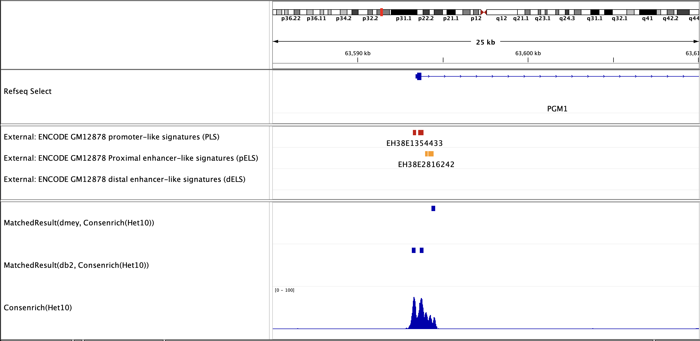

# Consenrich

[](https://github.com/nolan-h-hamilton/Consenrich/actions/workflows/Tests.yml)


[Consenrich](https://github.com/nolan-h-hamilton/Consenrich) is a sequential genome-wide state estimator for extraction of reproducible, spatially-resolved, epigenomic signals hidden in noisy multisample HTS data. The [corresponding manuscript preprint is available on bioRxiv](https://www.biorxiv.org/content/10.1101/2025.02.05.636702v1).

---

* **Input**:
  * $m \geq 1$ Sequence alignment files `-t/--bam_files` corresponding to each sample in a given HTS experiment
  * (*Optional*): $m_c = m$ control sample alignments, `-c/--control_files`, for each 'control' sample (e.g., ChIP-seq)
  * (*Optional*): wavelet-based template(s) to match for genome-wide pattern localization

* **Output**:
  * Genome-wide 'consensus' epigenomic state estimates and uncertainty metrics (BedGraph/BigWig)
  * (*Optional*) Matched regions (BED-like file of relative maxima in the cross-correlation with wavelet-based template(s))

<p align="center">
  <br/>
  <em>Example output: 10 ATAC-seq samples (lymphoblast) <code> -g hg38 --match_wavelet db2,db4,db8 --step 25 --delta 0.50</code></em>
</p>

---

**Features**

* Consenrich explicitly models dynamic signal trends and noise profiles for each sample with scale-invariance $\implies$ [Multi-sample, multi-assay estimation of target molecular states](docs/atac_dnase.png) from related functional genomics assays, e.g., ChIP-seq + CUT-N-RUN, ATAC-seq + DNase-seq.

* Consenrich yields uncertainty-moderated signal tracks that effectively encompass multiple samples' epigenomic profiles $\implies$ Insightful data representation for profiling condition-specific regulatory landscapes (e.g., via [consensus peak calling, differential analyses, etc.](docs/GRIN1.png))

* Consenrich [resolves legitimate spatial complexity and attenuates noise](docs/filter_comparison.png) $\implies$ Enables efficient genome-wide pattern localization for deeper profiling of signal trends or to subdivide broadly enriched regions.

## Download/Install

Consenrich is available via [PyPI/pip](https://pypi.org/project/consenrich/):

* `python -m pip install consenrich`

If lacking administrative privileges, running with flag `--user` may be necessary.

---

Consenrich can also be easily downloaded and installed from source:

1. `git clone https://github.com/nolan-h-hamilton/Consenrich.git`
2. `cd Consenrich`
3. `python setup.py sdist bdist_wheel`
4. `python -m pip install .`
5. Check installation: `consenrich --help`

## Manuscript Preprint and Citation

*Genome-Wide Uncertainty-Moderated Extraction of Signal Annotations from Multi-Sample Functional Genomics Data*\
Nolan H Hamilton, Benjamin D McMichael, Michael I Love, Terrence S Furey; doi: `10.1101/2025.02.05.636702`

---

**BibTeX**

```bibtex
@article {Hamilton2025
	author = {Hamilton, Nolan H and McMichael, Benjamin D and Love, Michael I and Furey, Terrence S},
	title = {Genome-Wide Uncertainty-Moderated Extraction of Signal Annotations from Multi-Sample Functional Genomics Data},
	year = {2025},
	doi = {10.1101/2025.02.05.636702},
	url = {https://www.biorxiv.org/content/10.1101/2025.02.05.636702v1},
}
```
