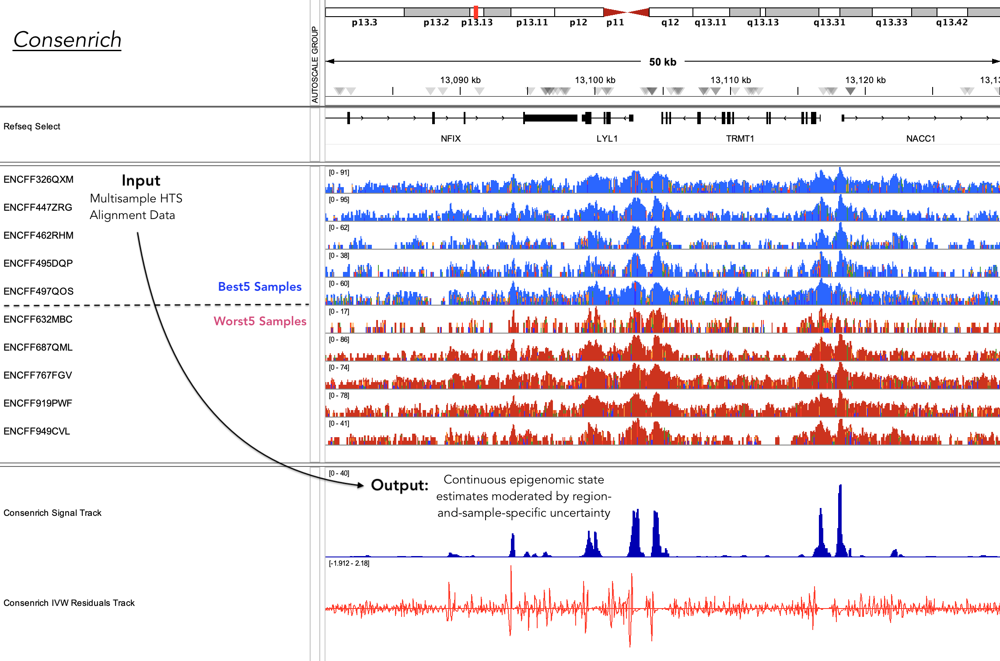

# Consenrich

[](https://github.com/nolan-h-hamilton/Consenrich/actions/workflows/Tests.yml)

*Consenrich is a sequential genome-wide state estimator for extraction of reproducible, spatially-resolved, epigenomic signals hidden in noisy multisample HTS data.*

* **Input**:
  * $m \geq 1$ Sequence alignment files `-t/--bam_files` corresponding to each sample in a given HTS experiment
  * (*Optional*): $m_c = m$ control sample alignments, `-c/--control_files`, for each 'treatment' sample (e.g., ChIP-seq)

```math
\underset{\textsf{Count Matrix from BAMs}}{\mathbf{Z} \in \mathbb{R}^{m \times n}}
\;~~\overset{\textsf{Consenrich}}{\longrightarrow}\;~~  
\underset{\textsf{Estimated signal and uncertainty sequences}}{\{\widehat{x}_i\}_{i=1}^{n},~~\{\widehat{\sigma}_i\}_{i=1}^{n}}
```

* **Output**: Real-valued 'consensus' epigenomic state estimates (BedGraph/BigWig) extracted from multiple HTS samples.

## Example Use

* Run Consenrich on ten ATAC-seq samples in the current directory. Generate a BigWig signal track and inverse-variance-weighted residuals.

   ```bash
   consenrich --bam_files *.bam -g hg38 -o hg38_test_output.tsv --signal_bigwig demo_signal.bw --residual_bigwig demo_ivw_residuals.bw
   ```



---

* Use Consenrich for ChIP-seq enrichment analysis with treatment/control sample alignments (POL2RA, six donors' colon tissue samples). Generate separate BigWig output tracks for signal estimates and inverse-variance weighted residuals. Use fixed-width genomic intervals of 25bp:

   ```bash
  consenrich \
    --bam_files \
      ENCSR322JEO_POL2RA.bam \
      ENCSR472VBD_POL2RA.bam \
      ENCSR431EHE_POL2RA.bam \
      ENCSR724FCJ_POL2RA.bam \
      ENCSR974HQI_POL2RA.bam \
      ENCSR132XRW_POL2RA.bam \
    --control_files \
      ENCSR322JEO_CTRL.bam \
      ENCSR472VBD_CTRL.bam \
      ENCSR431EHE_CTRL.bam \
      ENCSR724FCJ_CTRL.bam \
      ENCSR974HQI_CTRL.bam \
      ENCSR132XRW_CTRL.bam \
    -g hg38 --step 25 \
    -o Consenrich_POL2RA.tsv \
    --signal_bigwig Consenrich_POL2RA_CTRL_Signal.bw \
    --residual_bigwig Consenrich_POL2RA_CTRL_IVW_Residuals.bw
   ```

**Output**


## Download/Install

Consenrich can be easily downloaded and installed from source:

1. `git clone git@github.com:nolan-h-hamilton/Consenrich.git`
2. `cd Consenrich`
3. `python setup.py sdist bdist_wheel`
4. `python -m pip install .`
5. Check installation: `consenrich --help`

## Technical Features

* Effectively models sample-and-region-varying noise to better integrate data across heterogeneous samples
* Balances biologically-informed *a priori* predictions with observed HTS data to determine final estimates
* Provides interpretable uncertainty quantification with respect to multiple model aspects
* Runs efficiently in linear time with respect to genome size.
