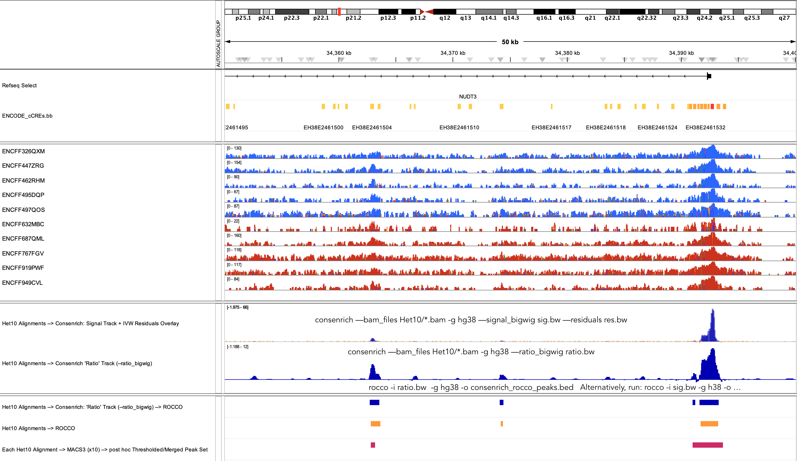

# Consenrich → Consensus Peak Calling

* Consenrich can be paired with peak callers such as [ROCCO](https://github.com/nolan-h-hamilton/ROCCO) to call consensus peaks given multiple HTS data.
* Methods based in pattern-matching or the [continuous wavelet transform (CWT)](https://docs.scipy.org/doc/scipy/reference/generated/scipy.signal.find_peaks_cwt.html) may also be effective.

We provide some casual examples below for ATAC-seq and ChIP-seq.

## ATAC-seq

## ChIP-seq

Users wishing to apply ROCCO to Consenrich ChIP-seq results may find it worthwhile to tune ROCCO's `--budget` parameter and/or run with `--narrowPeak` to filter peaks based on $p$-values *post hoc*. A dedicated ChIP-seq/Cut&Run mode for ROCCO is upcoming to mitigate dependence on fine-tuning or filtering results after the fact.
