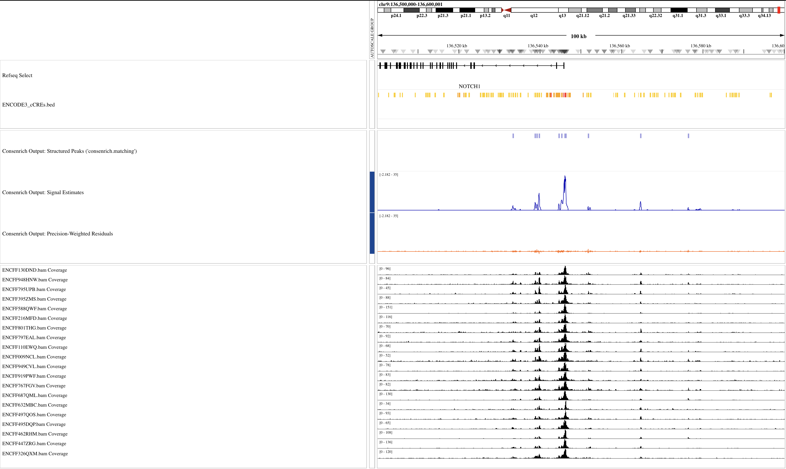
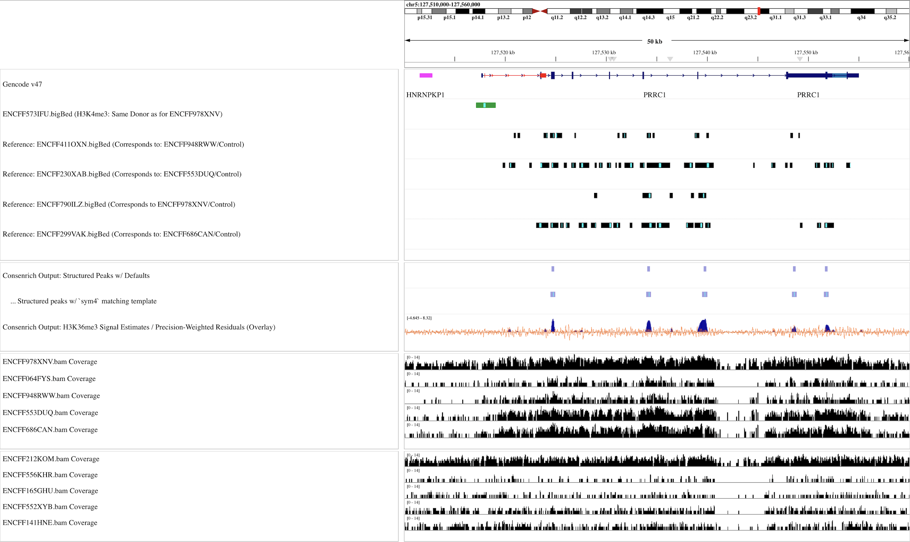
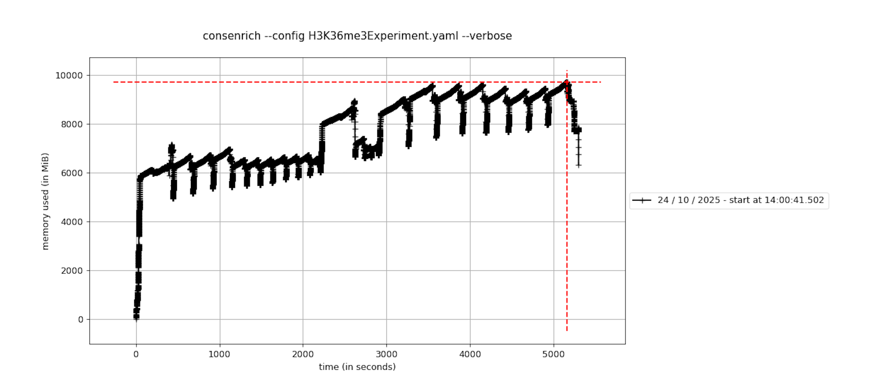
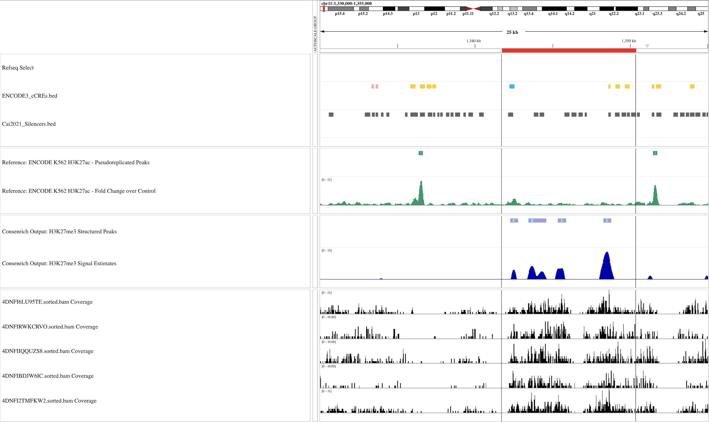
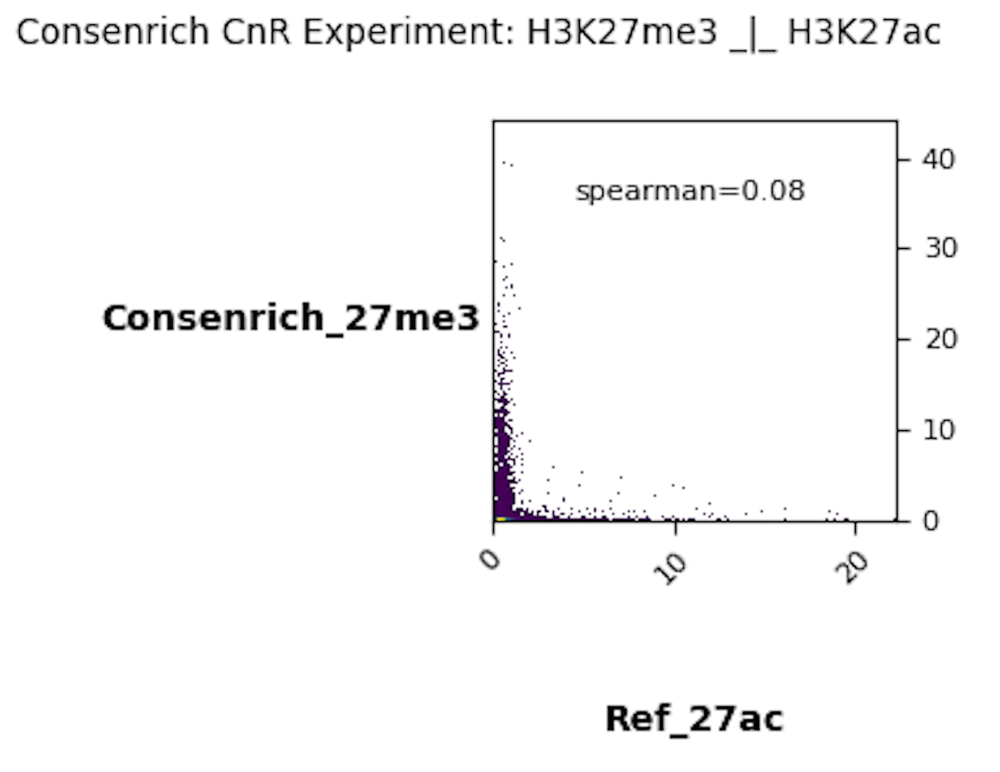
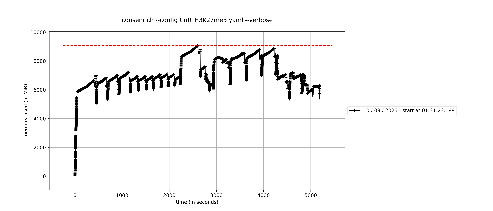

Quickstart + Usage
----------------------

.. toctree::
   :maxdepth: 1
   :caption: Quickstart + Usage
   :name: Usage

After installing Consenrich, you can run it via the command line (``consenrich -h``) or programmatically using the Python/Cython :ref:`API`.

.. _getting-started:

Getting Started: Minimal Example
~~~~~~~~~~~~~~~~~~~~~~~~~~~~~~~~~

.. toctree::
    :maxdepth: 2
    :caption: Getting Started
    :name: minimal

Here, a brief analysis using H3K27ac (narrow mark) ChIP-seq data is carried out for demonstration.

Input Data
"""""""""""""""""""""

The input data in this example consists of four donors' treatment and control samples (epidermal tissue) from ENCODE.

.. list-table:: Input Data
  :header-rows: 1
  :widths: 20 20 30 30

  * - Experiment
    - Biosample
    - H3K27ac Alignment
    - Control Alignment
  * - `ENCSR214UZE <https://www.encodeproject.org/experiments/ENCSR214UZE/>`_
    - Epidermis/Female/71
    - `ENCFF793ZHL.bam <https://www.encodeproject.org/files/ENCFF793ZHL/@@download/ENCFF793ZHL.bam>`_
    - `ENCFF444WVG.bam <https://www.encodeproject.org/files/ENCFF444WVG/@@download/ENCFF444WVG.bam>`_
  * - `ENCSR334DRN <https://www.encodeproject.org/experiments/ENCSR334DRN/>`_
    - Epidermis/Male/67
    - `ENCFF647VPO.bam <https://www.encodeproject.org/files/ENCFF647VPO/@@download/ENCFF647VPO.bam>`_
    - `ENCFF619NYP.bam <https://www.encodeproject.org/files/ENCFF619NYP/@@download/ENCFF619NYP.bam>`_
  * - `ENCSR340ZTB <https://www.encodeproject.org/experiments/ENCSR340ZTB/>`_
    - Epidermis/Female/80
    - `ENCFF809VKT.bam <https://www.encodeproject.org/files/ENCFF809VKT/@@download/ENCFF809VKT.bam>`_
    - `ENCFF898LKJ.bam <https://www.encodeproject.org/files/ENCFF898LKJ/@@download/ENCFF898LKJ.bam>`_
  * - `ENCSR386CKJ <https://www.encodeproject.org/experiments/ENCSR386CKJ/>`_
    - Epidermis/Male/75
    - `ENCFF295EFL.bam <https://www.encodeproject.org/files/ENCFF295EFL/@@download/ENCFF295EFL.bam>`_
    - `ENCFF490MWV.bam <https://www.encodeproject.org/files/ENCFF490MWV/@@download/ENCFF490MWV.bam>`_

Download Alignment Files from ENCODE
"""""""""""""""""""""""""""""""""""""""

Copy+paste the following to your terminal to download and index the BAM files for this demo.

You can also use ``curl -O <URL>`` in place of ``wget <URL>`` if the latter is not available on your system.

.. code-block:: bash

  encodeFiles=https://www.encodeproject.org/files

  for file in ENCFF793ZHL ENCFF647VPO ENCFF809VKT ENCFF295EFL; do
      wget "$encodeFiles/$file/@@download/$file.bam"
  done

  for ctrl in ENCFF444WVG ENCFF619NYP ENCFF898LKJ ENCFF490MWV; do
      wget "$encodeFiles/$ctrl/@@download/$ctrl.bam"
  done

  samtools index -M *.bam

Using a YAML Configuration file
"""""""""""""""""""""""""""""""""""""

.. tip::

   Refer to the ``<process,observation,etc.>Params`` classes in module in the :ref:`API` for complete documentation of configuration options.

Copy and paste the following YAML into a file named ``demoHistoneChIPSeq.yaml``. For a quick trial run (:math:`\approx` 1 minute), you can restrict analysis to a subset of chromosomes: To reproduce the results shown in the IGV browser snapshot below add ``genomeParams.chromosomes: [chr21, chr22]`` to the configuration file.

.. code-block:: yaml
  :name: demoHistoneChIPSeq.yaml

  experimentName: demoHistoneChIPSeq
  genomeParams.name: hg38
  genomeParams.chromosomes: [chr21, chr22] # remove this line to run genome-wide
  genomeParams.excludeForNorm: [chrX, chrY]

  inputParams.bamFiles: [ENCFF793ZHL.bam,
  ENCFF647VPO.bam,
  ENCFF809VKT.bam,
  ENCFF295EFL.bam]

  inputParams.bamFilesControl: [ENCFF444WVG.bam,
  ENCFF619NYP.bam,
  ENCFF898LKJ.bam,
  ENCFF490MWV.bam]

  # Optional: call 'structured peaks' via `consenrich.matching`
  matchingParams.templateNames: [haar, db2]

.. admonition:: Control Inputs
  :class: tip

  Omit ``inputParams.bamFilesControl`` for ATAC-seq, DNase-seq, Cut&Run, and other assays where no control is available or applicable.

Run Consenrich
"""""""""""""""""""""

.. admonition:: Guidance: Command-line vs. Programmatic Usage
  :class: tip
  :collapsible: closed

  The command-line interface is a convenience wrapper that may not expose all available objects or more niche features.
  Some users may find it beneficial to run Consenrich programmatically (via Jupyter notebooks, Python scripts), as the :ref:`API` enables
  greater flexibility to apply custom preprocessing steps and various context-specific protocols within existing workflows.

.. code-block:: console
  :name: Run Consenrich

  % consenrich --config demoHistoneChIPSeq.yaml --verbose

Output Files and Formats
"""""""""""""""""""""""""""""""""

Consenrich generates the following output files:

* **Signal estimate track**: ``<experimentName>_consenrich_state.bw``

  * This track records the genome-wide Consenrich estimates for the primary signal of interest :math:`\widetilde{x}_{[i]},~i=1,\ldots,n`, derived from input samples' alignment/count data
  * A human-readable bedGraph file is also generated: ``consenrichOutput_<experimentName>_consenrich_state.bedGraph``
  * See :func:`consenrich.core.getPrimaryState`

* **Precision-weighted residual track**: ``<experimentName>_consenrich_residuals.bw``

  * This track records the uncertainty-scaled differences between the Consenrich estimates and the observed sample data at each interval
  * A human-readable bedGraph file is also generated: ``consenrichOutput_<experimentName>_consenrich_residuals.bedGraph``
  * See :func:`consenrich.core.getPrecisionWeightedResidual`

* **Structured peak calls** (Optional): ``<experimentName>_matches.mergedMatches.narrowPeak``

  * BED-like annotation of enriched signal regions showing a regular structure. Only generated if the matching algorithm is invoked.
  * See :ref:`matching` and :func:`consenrich.matching.matchWavelet`

.. admonition:: Guidance: `Consenrich+ROCCO`: Consensus Peak Calling
  :class: tip
  :collapsible: closed

  Consenrich can markedly improve conventional consensus peak calling and between-group differential analyses (see `Enhanced Consensus Peak Calling and Differential Analyses in Complex Human Disease <https://www.biorxiv.org/content/10.1101/2025.02.05.636702v2>`_ in the manuscript preprint.)

  `ROCCO <https://github.com/nolan-h-hamilton/ROCCO>`_ can accept Consenrich bigWig files as input and is particularly well-suited to leverage high-resolution signal estimates while balancing regularity in a manner that is useful for simultaneous broad/narrow peak calling.

  In the example above, to call peaks using the `Consenrich+ROCCO` protocol, run:

  .. code-block:: console

	  % python -m pip install rocco --upgrade
	  % rocco -i demoHistoneChIPSeq_consenrich_state.bw -g hg38 -o consenrichRocco_demoHistoneChIPSeq.bed

  * The experimental :ref:`matching` algorithm available with Consenrich may be effective as a complement or substitute for existing peak calling methods---e.g., detecting 'structured' enrichment patterns across multiple samples or identifying subpeaks within broad regions of interest.

  * Alternative peak calling methods that accept bedGraph or bigWig input (e.g., `MACS' bdgpeakcall <https://macs3-project.github.io/MACS/docs/bdgpeakcall.html>`_) should be capable of utilizing Consenrich signal tracks. Only ROCCO has been evaluated for this task to date.

Results
""""""""""""""""""""""""""

We display results at a **50kb** enhancer-rich region overlapping `MYH9`.

.. image:: ../images/ConsenrichIGVdemoHistoneChIPSeq.png
  :alt: Output Consenrich Signal Estimates
    :width: 800px
    :align: left

The treatment and control alignment coverage tracks are shown in black. Additionally, ENCODE's default signal quantification tracks for histone ChIP-seq---the ``fold change over control`` bigWig files---are displayed for each sample in red.

.. _additional-examples:

Additional Examples and Benchmarking
~~~~~~~~~~~~~~~~~~~~~~~~~~~~~~~~~~~~~~~~~~~~~~~~~~~~

.. toctree::
   :maxdepth: 2
   :caption: Additional Examples and Computational Benchmarking

This section of the documentation will be regularly updated to include a breadth of assays, downstream analyses, and runtime benchmarks.

ATAC-seq
""""""""""""""""

- Input data (`atac20`): :math:`m=20` ATAC-seq BAM files derived from lymphoblastoid cell lines (ENCODE)
- Varying data quality (e.g., `Extremely low read depth <https://www.encodeproject.org/data-standards/audits/#extremely_low_read_depth>`_)

Environment
''''''''''''''

- MacBook MX313LL/A (arm64)
- Python 3.12.9
- `HTSlib (Samtools) <https://www.htslib.org/>`_ 1.21
- `Bedtools <https://bedtools.readthedocs.io/en/latest/>`_ 2.31.1

Names and versions of packages that are relevant to computational performance. These specific versions are *not required* but are included for reproducibility.

.. list-table::
     :header-rows: 1
     :widths: 40 60

     * - Package
       - Version
     * - ``cython``
       - 3.1.2
     * - ``numpy``
       - 2.3.2
     * - ``scipy``
       - 1.16.1

Configuration
''''''''''''''''''''''''''''

Run with the following YAML config file `atac20Benchmark.yaml`. Note that several parameters are listed and/or adjusted for demonstration purposes.

Note that globs, e.g., `*.bam`, are allowed, but the BAM file names are listed explicitly in the config to show their ENCODE accessions for reference.

.. admonition:: Guidance: Tuning Memory Usage vs. Runtime
  :class: tip
  :collapsible: closed

  Consenrich is generally memory-efficient and can be run on large datasets using only consumer grade hardware (See :ref:`runtimeAndMemoryProfilingAtac20`). Memory cost can be reduced by decreasing `samParams.chunkSize` in the configuration file. Smaller chunk sizes may affect runtime due to overhead from more frequent file I/O, however.

.. admonition:: Guidance: Balancing Confidence in Noisy Data versus *a priori* Model Predictions
  :class: tip
  :collapsible: closed

  Note that default values should generally suffice given the adaptive process and observation models, but base-level uncertainty for each can be tuned if one source is deemed consistently more reliable than the other.

  An informal summary of these parameters' effects is as follows:

  - Increasing ``processParams.minQ``:

    .. math::

      \textsf{Greater base-level uncertainty assigned to propagated predictions } \rightarrow \textsf{ data favored in estimation}

    - In other words, *restrict influence of the a priori model for signal/variance propagation to accommodate greater confidence in the data*

  - Increasing ``observationParams.minR``:

    .. math::

      \textsf{Greater base-level uncertainty assigned to data } \rightarrow \textsf{ propagated predictions favored in estimation}

    - In other words, *restrict reliance on data to accommodate greater confidence in the a priori model for signal/variance propagation*

.. code-block:: yaml

  experimentName: atac20Benchmark
  genomeParams.name: hg38
  genomeParams.excludeChroms: ['chrY']
  genomeParams.excludeForNorm: ['chrX', 'chrY']
  inputParams.bamFiles: [
    ENCFF326QXM.bam,
    ENCFF497QOS.bam,
    ENCFF919PWF.bam,
    ENCFF447ZRG.bam,
    ENCFF632MBC.bam,
    ENCFF949CVL.bam,
    ENCFF462RHM.bam,
    ENCFF687QML.bam,
    ENCFF495DQP.bam,
    ENCFF767FGV.bam,
    ENCFF009NCL.bam,
    ENCFF110EWQ.bam,
    ENCFF797EAL.bam,
    ENCFF801THG.bam,
    ENCFF216MFD.bam,
    ENCFF588QWF.bam,
    ENCFF795UPB.bam,
    ENCFF395ZMS.bam,
    ENCFF130DND.bam,
    ENCFF948HNW.bam
  ]

  processParams.minQ: 0.05 # (default 0.25)
  matchingParams.templateNames: [haar, db2]
  matchingParams.minSignalAtMaxima: 'q:0.50' # (default 'q:0.75')
  matchingParams.alpha: 0.05 # (default 0.05)

Run Consenrich
''''''''''''''''''''

.. code-block:: console

  % consenrich --config atac20Benchmark.yaml --verbose

Results
''''''''''''''''''''''''''''

- Output tracks and features are visualized above in a **100kb** region overlapping Gencode v47 `NOTCH1`.

Structured peak calls are positioned above the Consenrich signal as BED features.

- Focused view over a **25kb** subregion:

.. image:: ../benchmarks/atac20/images/atac20BenchmarkIGVSpib25KB.png
    :alt: IGV Browser Snapshot (25kb)
    :width: 800px
    :align: left

**Evaluating Structured Peak Results: cCRE Overlaps**

We measure overlap between the Consenrich-detected regions and previously-identified candidate regulatory elements (`ENCODE4 GRCh38 cCREs <https://screen.wenglab.org/downloads>`_).

Note that the ENCODE cCREs are not specific to our lymphoblastoid input dataset (`atac20`) and a perfect concordance is not expected.

* We first count:

  - The total number of Consenrich-detected structured peaks
  - The number of unique Consenrich-detected structured peaks sharing at least a :math:`25\%` *reciprocal* overlap with an ENCODE4 cCRE

  .. code-block:: console

    % bedtools intersect \
      -a consenrichOutput_atac20Benchmark_matches.mergedMatches.narrowPeak \
      -b GRCh38-cCREs.bed \
      -f 0.25 -r -u \
      | wc -l

* We also evaluate hit-rates compared to a null baseline: '*After controlling for feature size and chromosome placement, how many cCRE-hits could we expect by random selection?*'

  We invoke `bedtools shuffle <https://bedtools.readthedocs.io/en/latest/content/tools/shuffle.html>`_ in :math:`N=100` independent trials

  .. code-block:: console

    % bedtools shuffle \
      -i consenrichOutput_atac20Benchmark_matches.mergedMatches.narrowPeak \
      -g hg38.sizes \
      -chrom \
      | bedtools intersect -a stdin -b GRCh38-cCREs.bed -f 0.25 -r -u \
      | wc -l

  and aggregate results to estimate the empirical distribution of cCRE-hits.

* Consenrich vs. Baseline: :math:`2.9\times \textsf{FC}, p \approx 0.009`

  +--------------------------------------------------+-------------------------------+
  | Feature                                          | Value                         |
  +==================================================+===============================+
  | Consenrich: Total structured peaks (α=0.05)      | 261,004                       |
  +--------------------------------------------------+-------------------------------+
  | Consenrich: Distinct cCRE overlaps*              | 220,517                       |
  +--------------------------------------------------+-------------------------------+
  | Consenrich: Percent overlapping                  | 84.5%                         |
  +--------------------------------------------------+-------------------------------+
  | Random (``shuffle``): Distinct cCRE overlaps*    | μ=77,990.7 / σ=221.3          |
  +--------------------------------------------------+-------------------------------+
  | Random (``shuffle``): Percent overlapping        | 29.9%                         |
  +--------------------------------------------------+-------------------------------+

  :math:`\ast`: ``bedtools intersect -f 0.25 -r -u``

.. admonition:: Guidance: Significance Thresholds for Structured Peak Calling
  :class: tip
  :collapsible: closed

  The default significance thresholds may be too lenient (strict) depending on the application. For example, in the `atac20` example, a smaller more confident peak set could be desirable.

  - Decreasing ``matchingParams.alpha`` (e.g., :math:`\alpha = 0.05 \longrightarrow \alpha = 0.01`) and counting overlaps again,

    .. code-block:: console

      % bedtools intersect -a atac20FilteredAlpha01.narrowPeak \
            -b GRCh38-cCREs.bed \
            -f 0.25 -r -u \
        > cCREOverlap_atac20FilteredAlpha01.narrowPeak # (76,783 / 78,411) regions

  brings the percent of `atac20` Consenrich matches that share a :math:`25\%` *reciprocal* overlap with the ENCODE cCREs to **97.9%** --- at the cost of fewer total detections.

  Note, we can also increase the secondary, *signal-level* cutoff, ``matchingParams.minSignalAtMaxima``, that controls the minimum allowed :math:`\widetilde{x}_{[\cdot]}` at each candidate match.

.. _runtimeAndMemoryProfilingAtac20:

Runtime and Memory Profiling
''''''''''''''''''''''''''''''''''

Memory was profiled using the package `memory-profiler <https://pypi.org/project/memory-profiler/>`_. See the plot below for memory usage over time. Function calls are marked as notches.

Note that the repeated sampling of memory every 0.1 seconds during profiling introduces some overhead that affects runtime.

.. image:: ../benchmarks/atac20/images/atac20BenchmarkMemoryPlot.png
    :alt: Time vs. Memory Usage (`memory-profiler`)
    :width: 800px
    :align: center

----

ChIP-seq: Broad Histone Marks
"""""""""""""""""""""""""""""""""""""""""""""

- Five mucosal tissue donors, each with H3K36me3/control alignment files from ENCODE.
- Single-end, mixed-length reads (36, 76)

These samples vary in quality, with 4/5 flagged by ENCODE for low read length and/or insufficient depth, making for a challenging but viable multi-sample analysis setting.

Environment
''''''''''''''

- MacBook MX313LL/A (arm64)
- Python 3.12.9
- `HTSlib (Samtools) <https://www.htslib.org/>`_ 1.21
- `Bedtools <https://bedtools.readthedocs.io/en/latest/>`_ 2.31.1
- `ROCCO <https://github.com/nolan-h-hamilton/ROCCO>`_ 1.6.3

Names and versions of packages that are relevant to computational performance. These specific versions are *not required* but are included for reproducibility.

.. list-table::
     :header-rows: 1
     :widths: 40 60

     * - Package
       - Version
     * - ``cython``
       - 3.1.2
     * - ``numpy``
       - 2.3.2
     * - ``scipy``
       - 1.16.1
     * - ``rocco``
       - 1.6.3

Configuration
''''''''''''''''''''''''''''

We save the following YAML configuration as ``H3K36me3Experiment.yaml``.

.. code-block:: yaml

  experimentName: H3K36me3Experiment
  genomeParams.name: hg38
  genomeParams.excludeChroms: ['chrY']
  genomeParams.excludeForNorm: ['chrX','chrY']

  inputParams.bamFiles: [ENCFF978XNV.bam,
    ENCFF064FYS.bam, # ENCODE flag: 'Insufficient read depth'
    ENCFF948RWW.bam, # ENCODE flag: 'Insufficient read depth, Low read length'
    ENCFF553DUQ.bam, # ENCODE flag: 'Insufficient read depth, Low read length'
    ENCFF686CAN.bam, # ENCODE flag: 'Insufficient read depth, Low read length'
  ]

  inputParams.bamFilesControl: [ENCFF212KOM.bam,
    ENCFF556KHR.bam,
    ENCFF165GHU.bam,
    ENCFF552XYB.bam,
    ENCFF141HNE.bam
  ]

  # Recommended for single-end data, broad marks, low coverage, etc.
  samParams.inferFragmentLength: 1

  # Broad marks + sparse data:
  # consider a larger, more symmetric template and merging window
  matchingParams.templateNames: [sym4]
  matchingParams.minMatchLengthBP: 500
  matchingParams.mergeGapBP: 250
  matchingParams.alpha: 0.01

Run Consenrich
''''''''''''''''''''''''''''

.. code-block:: console

  % consenrich --config H3K36me3Experiment.yaml --verbose

Results
''''''''''''''''''''''''''''

For a qualitative, biologically-motivated check, we evaluate results over `PRRC1` in light of `Figure 3A in (Andersson et al., 2009) <https://genome.cshlp.org/content/19/10/1732>`_: *H3K36me3 signal is overrepresented at internal exons with respect to succeeding introns.*

* Note that we are using colonic mucosal tissue samples, whereas Andersson et al. used CD4+ T cells. Nonetheless, PRRC1 is consistently expressed in colonic mucosa, and we can expect at least a loose concordance in H3K36me3 enrichment patterns.

As in `Andersson et al. <https://genome.cshlp.org/content/19/10/1732>`_,

* Near the transcription start site of `PRRC1`, we observe a strong, transient H3K27ac peak followed by a broad increase in Consenrich-estimated H3K36me3 signal
* Within `PRRC1`, the strongest H3K36me3 Consenrich-estimated signals appear at exons >1, `GENCODE-annotated <https://www.gencodegenes.org/human/release_47.html>`_ followed by abrupt depletions

Runtime and Memory Profiling
''''''''''''''''''''''''''''''''''

Memory use was profiled with the package `memory-profiler <https://pypi.org/project/memory-profiler/>`_. See the plot below for RSS over time. Function calls are marked as notches.

Note that the repeated sampling of memory every 0.1 seconds during profiling introduces some overhead that affects runtime.

----

CUT&RUN: H3K27me3
""""""""""""""""""""

- Input data: :math:`m=5` H3K27me3 CUT&RUN samples -- `4D Nucleome K562 <https://data.4dnucleome.org/experiment-set-replicates/4DNESTTCK612/>`_
- Paired-end, **25bp** reads

Environment
''''''''''''''

- MacBook MX313LL/A (arm64)
- Python 3.12.9
- `HTSlib (Samtools) <https://www.htslib.org/>`_ 1.21
- `Bedtools <https://bedtools.readthedocs.io/en/latest/>`_ 2.31.1

Names and versions of packages that are relevant to computational performance. These specific versions are *not required* but are included for reproducibility.

.. list-table::
     :header-rows: 1
     :widths: 40 60

     * - Package
       - Version
     * - ``cython``
       - 3.1.2
     * - ``numpy``
       - 2.3.2
     * - ``scipy``
       - 1.16.1

Configuration
''''''''''''''''''''''''''''

.. admonition:: Guidance: Noise level approximation for heterochromatic or repressive targets
  :class: tip
  :collapsible: closed

  When targeting signals associated with *heterochromatin/repression* (e.g., H3K9me3 ChIP-seq/CUT&RUN, H3K27me3 ChIP-seq/CUT&RUN, MNase-seq), consider setting ``observationParams.useALV: true``

  This prevents real signal being from being attributed to noise and may be consequential for higher-resolution analyses.

We save the following YAML configuration as ``CnR_H3K27me3.yaml``.

.. code-block:: yaml

  experimentName: CnRH3K27me3Experiment
  genomeParams.name: hg38
  genomeParams.excludeChroms: ['chrY']
  genomeParams.excludeForNorm: ['chrX','chrY']

  inputParams.bamFiles: [4DNFIBDJW6IC.sorted.bam,
   4DNFIRWKCRVO.sorted.bam,
   4DNFIIQQUZS8.sorted.bam,
   4DNFI6LU95TE.sorted.bam,
   4DNFI2TMFKW2.sorted.bam
  ]
  samParams.pairedEndMode: 1

  # Guidance: 'Noise level approximation for heterochromatic/repressive targets'
  observationParams.useALV: true

  # Broad marks + sparse data
  matchingParams.templateNames: [sym4]
  matchingParams.minMatchLengthBP: 500
  matchingParams.mergeGapBP: 250
  matchingParams.alpha: 0.01

Run Consenrich
''''''''''''''''''''

.. code-block:: console

  % consenrich --config CnR_H3K27me3.yaml --verbose

Results
''''''''''''''''''''''''''''

- In H3K27me3-enriched domains, we observe patterns consistent with `Cai et al. (2021) <https://pubmed.ncbi.nlm.nih.gov/33514712/>`_, where putative silencer elements are often marked by H3K27me3.

- Strong H3K27me3 and H3K27ac signals rarely coincide. As a qualitative reference in the IGV browser snapshot above, we include the K562/H3K27ac 'fold change over control' track from ENCODE `ENCFF381NDD <https://www.encodeproject.org/files/ENCFF381NDD/>`_.

To further assess the relationship between these two modifications quantitatively, we compute their genome-wide Spearman correlations using deeptools' `multiBigWigSummary <https://deeptools.readthedocs.io/en/develop/content/tools/multiBigwigSummary.html>`_ and `plotCorrelation <https://deeptools.readthedocs.io/en/develop/content/tools/plotCorrelation.html>`_ commands.

`Cai-Fullwood-2021.Silencer-cCREs.bed` is available from SCREEN: `Human --> cCREs by class --> Silencer Sets (.tar.gz)  <https://screen.wenglab.org/downloads>`_.

.. code-block:: console

  % bedtools sort -i Cai-Fullwood-2021.Silencer-cCREs.bed | cut -f 1-3 > Cai2021_Silencers.bed

  % multiBigWigSummary BED-file --BED Cai2021_Silencers.bed \
   -b CnRH3K27me3Experiment_consenrich_state.bw ENCFF381NDD.bigWig \
   -o results.npz

  % plotCorrelation -in results.npz \
   -p scatterplot --corMethod spearman \
   --removeOutliers --skipZeros --plotFile CnRH3K27me3Scatter.png \
   --plotTitle "Consenrich CnR Experiment: H3K27me3 _|_ H3K27ac" \
   --labels Consenrich_27me3 Ref_27ac

Runtime and Memory Profiling
''''''''''''''''''''''''''''''''''

Memory was profiled using the package `memory-profiler <https://pypi.org/project/memory-profiler/>`_. See the plot below for memory usage over time. Function calls are marked as notches.

Note that the repeated sampling of memory every 0.1 seconds during profiling introduces some overhead that affects runtime.

