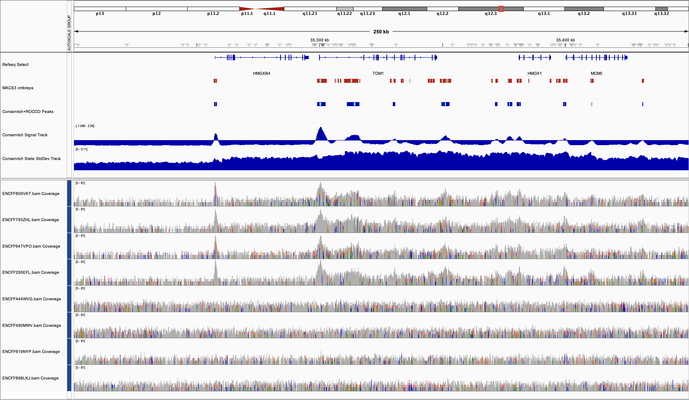
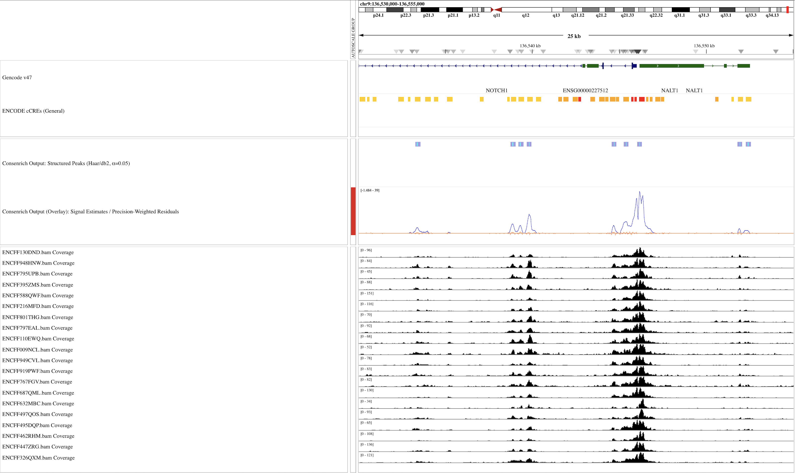
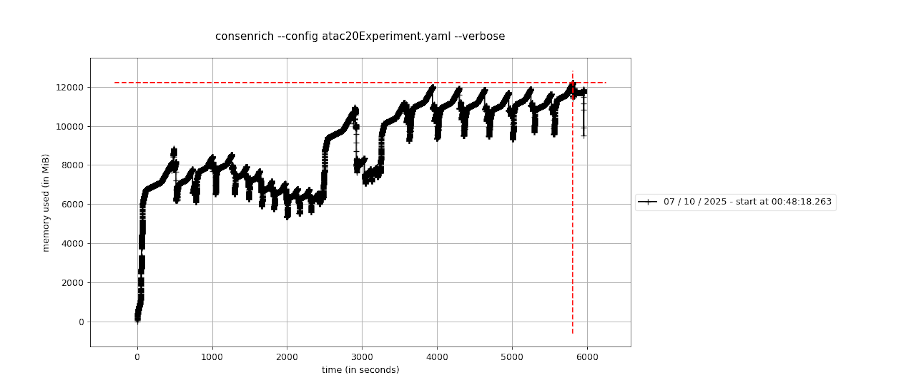
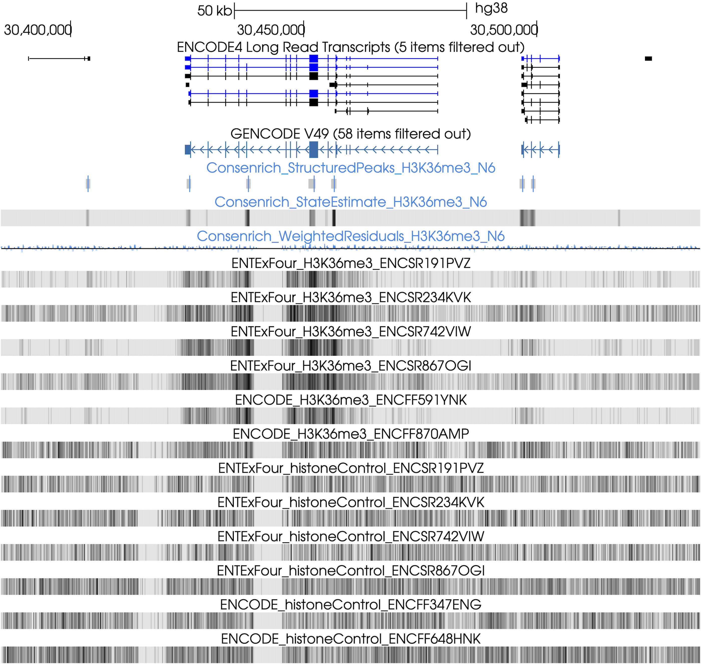

Quickstart + Usage
----------------------

.. toctree::
   :maxdepth: 1
   :caption: Quickstart + Usage
   :name: Usage

After installing Consenrich, you can run it via the command line (``consenrich -h``) or programmatically using the Python/Cython :ref:`API`.

We provide several usage examples below. See also :ref:`files` and :ref:`tips` for more information.

.. _getting-started:

Getting Started: Minimal Example
~~~~~~~~~~~~~~~~~~~~~~~~~~~~~~~~~

.. toctree::
    :maxdepth: 2
    :caption: Getting Started
    :name: minimal

A brief analysis using H3K27ac (narrow mark) ChIP-seq data is carried out for demonstration.

Input Data
"""""""""""""""""""""

The input data in this example consists of four donors' treatment and control samples (epidermal tissue) from ENCODE.

.. list-table:: Input Data
  :header-rows: 1
  :widths: 20 20 30 30

  * - Experiment
    - Biosample
    - H3K27ac Alignment
    - Control Alignment
  * - `ENCSR214UZE <https://www.encodeproject.org/experiments/ENCSR214UZE/>`_
    - Epidermis/Female/71
    - `ENCFF793ZHL.bam <https://www.encodeproject.org/files/ENCFF793ZHL/@@download/ENCFF793ZHL.bam>`_
    - `ENCFF444WVG.bam <https://www.encodeproject.org/files/ENCFF444WVG/@@download/ENCFF444WVG.bam>`_
  * - `ENCSR334DRN <https://www.encodeproject.org/experiments/ENCSR334DRN/>`_
    - Epidermis/Male/67
    - `ENCFF647VPO.bam <https://www.encodeproject.org/files/ENCFF647VPO/@@download/ENCFF647VPO.bam>`_
    - `ENCFF619NYP.bam <https://www.encodeproject.org/files/ENCFF619NYP/@@download/ENCFF619NYP.bam>`_
  * - `ENCSR340ZTB <https://www.encodeproject.org/experiments/ENCSR340ZTB/>`_
    - Epidermis/Female/80
    - `ENCFF809VKT.bam <https://www.encodeproject.org/files/ENCFF809VKT/@@download/ENCFF809VKT.bam>`_
    - `ENCFF898LKJ.bam <https://www.encodeproject.org/files/ENCFF898LKJ/@@download/ENCFF898LKJ.bam>`_
  * - `ENCSR386CKJ <https://www.encodeproject.org/experiments/ENCSR386CKJ/>`_
    - Epidermis/Male/75
    - `ENCFF295EFL.bam <https://www.encodeproject.org/files/ENCFF295EFL/@@download/ENCFF295EFL.bam>`_
    - `ENCFF490MWV.bam <https://www.encodeproject.org/files/ENCFF490MWV/@@download/ENCFF490MWV.bam>`_

Download Alignment Files from ENCODE
"""""""""""""""""""""""""""""""""""""""

Copy+paste the following to your terminal to download and index the BAM files for this demo.

You can also use ``curl -O <URL>`` in place of ``wget <URL>`` if the latter is not available on your system.

.. code-block:: bash

  encodeFiles=https://www.encodeproject.org/files
  for file in ENCFF793ZHL ENCFF647VPO ENCFF809VKT ENCFF295EFL; do
      wget "$encodeFiles/$file/@@download/$file.bam"
  done
  for ctrl in ENCFF444WVG ENCFF619NYP ENCFF898LKJ ENCFF490MWV; do
      wget "$encodeFiles/$ctrl/@@download/$ctrl.bam"
  done
  samtools index -M *.bam

Using a YAML Configuration file
"""""""""""""""""""""""""""""""""""""

.. tip::

   Refer to the ``<process,observation,etc.>Params`` classes in module in the :ref:`API` for complete documentation of configuration options.

Copy and paste the following YAML into a file named ``demoHistoneChIPSeq.yaml``. For a quick trial run (:math:`\approx` 1 minute), you can restrict analysis to a subset of chromosomes: To reproduce the results shown in the browser snapshot, add ``genomeParams.chromosomes: [chr21, chr22]`` to the configuration file.

.. code-block:: yaml
  :name: demoHistoneChIPSeq.yaml

  # v0.7.11b1
  experimentName: demoHistoneChIPSeq
  genomeParams.name: hg38
  genomeParams.chromosomes: [chr21, chr22] # remove this line to run genome-wide
  genomeParams.excludeForNorm: [chrX, chrY]

  inputParams.bamFiles: [ENCFF793ZHL.bam,
  ENCFF647VPO.bam,
  ENCFF809VKT.bam,
  ENCFF295EFL.bam]

  inputParams.bamFilesControl: [ENCFF444WVG.bam,
  ENCFF619NYP.bam,
  ENCFF898LKJ.bam,
  ENCFF490MWV.bam]

  # Optional: call 'structured peaks'
  matchingParams.templateNames: [haar, db2]
  matchingParams.cascadeLevels: [3,3]
  matchingParams.methodFDR: BH
  outputParams.writeStateStd: true

.. admonition:: Control Inputs
  :class: tip

  Omit ``inputParams.bamFilesControl`` for ATAC-seq, DNase-seq, Cut&Run, and other assays where no control is available or applicable.

Run Consenrich
"""""""""""""""""""""

.. admonition:: Guidance: Command-line vs. Programmatic Usage
  :class: tip
  :collapsible: closed

  The command-line interface is a convenience wrapper that may not expose all available objects or more niche features.
  Some users may find it beneficial to run Consenrich programmatically (e.g., in a Jupyter notebook, Python script), as the :ref:`API` enables
  greater flexibility to apply custom preprocessing steps and various context-specific protocols within existing workflows.

.. code-block:: console
  :name: Run Consenrich

  % consenrich --config demoHistoneChIPSeq.yaml --verbose

Results
""""""""""""""""""""""""""

* We display Consenrich results (blue) at ``APOL2 <--| |--> APOL1``

* For reference, ENCODE peaks (label: `rep1 pseudoreplicated peaks`) for the same `Experiments` and donor samples are included (black):

  * `ENCODE Histone ChIP-seq pipeline (unreplicated) <https://www.encodeproject.org/pipelines/ENCPL841HGV/>`_ (MACS peak calls, partition concordance)

.. _additional-examples:

Additional Examples and Benchmarking
~~~~~~~~~~~~~~~~~~~~~~~~~~~~~~~~~~~~~~~~~~~~~~~~~~~~

.. toctree::
   :maxdepth: 2
   :caption: Additional Examples and Computational Benchmarking

This section of the documentation will be regularly updated to include a breadth of assays, downstream analyses, and runtime benchmarks.

ATAC-seq
""""""""""""""""

- Input data (`atac20`): :math:`m=20` ATAC-seq BAM files derived from lymphoblastoid cell lines (ENCODE)
- Varying data quality (e.g., `Extremely low read depth <https://www.encodeproject.org/data-standards/audits/#extremely_low_read_depth>`_)

Environment
''''''''''''''

- MacBook MX313LL/A (arm64)
- Python `3.12.9`
- Consenrich `v0.7.9b1`
- `HTSlib (Samtools) <https://www.htslib.org/>`_ 1.22.1
- `Bedtools <https://bedtools.readthedocs.io/en/latest/>`_ 2.31.1

Names and versions of packages that are relevant to computational performance. These specific versions are *not required* but are included for reproducibility.

.. list-table::
     :header-rows: 1
     :widths: 40 60

     * - Package
       - Version
     * - ``cython``
       - 3.1.4
     * - ``numpy``
       - 2.3.3
     * - ``scipy``
       - 1.16.2

Configuration
''''''''''''''''''''''''''''

Run with the following YAML config file `atac20Benchmark.yaml`. Note that several parameters are listed and/or adjusted for demonstration purposes.

globs, e.g., `*.bam`, are allowed, but each file is listed below to reveal ENCODE accessions

.. code-block:: yaml

  experimentName: atac20Benchmark
  genomeParams.name: hg38
  genomeParams.excludeChroms: ['chrY']
  genomeParams.excludeForNorm: ['chrX', 'chrY']
  inputParams.bamFiles: [
    ENCFF326QXM.bam,
    ENCFF497QOS.bam,
    ENCFF919PWF.bam,
    ENCFF447ZRG.bam,
    ENCFF632MBC.bam,
    ENCFF949CVL.bam,
    ENCFF462RHM.bam,
    ENCFF687QML.bam,
    ENCFF495DQP.bam,
    ENCFF767FGV.bam,
    ENCFF009NCL.bam,
    ENCFF110EWQ.bam,
    ENCFF797EAL.bam,
    ENCFF801THG.bam,
    ENCFF216MFD.bam,
    ENCFF588QWF.bam,
    ENCFF795UPB.bam,
    ENCFF395ZMS.bam,
    ENCFF130DND.bam,
    ENCFF948HNW.bam
  ]

  # Optional: call 'structured peaks' via `consenrich.matching`
  matchingParams.templateNames: [haar, db2]
  matchingParams.cascadeLevels: [3, 3]
  matchingParams.minMatchLengthBP: -1
  matchingParams.mergeGapBP: -1

  # Optional: plot distributions
  plotParams.plotStateTrace: true
  plotParams.plotResidualsHistogram: true
  plotParams.plotStateStdHistogram: true
  countingParams.applySqrt: true

Run Consenrich
''''''''''''''''''''

.. code-block:: console

  % consenrich --config atac20Benchmark.yaml --verbose

Results
''''''''''''''''''''''''''''

**Browser Snapshot**

**Visualizing State and Residual Distributions**

For downstream analyses, it can be useful to inspect the distributions of state estimates, residuals, and state uncertainties.

Basic convenience utilities are provided for this purpose. Here, we display plots corresponding to `chr19`, as in the browser snapshot above. Note, ``plotParams.plot<...>`` will create a separate directory ``<experimentName>_consenrichPlots`` to store files.

.. list-table::
   :widths: 32 32 32
   :align: left

   * - .. image:: ../benchmarks/atac20/images/consenrichPlot_hist_chr19_atac20Benchmark_state.png
          :alt: Approximate state/signal distribution for atac20 Demo (v0.7.7b1, applySqrt: true)
          :width: 100%
     - .. image:: ../benchmarks/atac20/images/consenrichPlot_hist_chr19_atac20Benchmark_residuals.png
          :alt: Residual distribution for atac20 Demo (v0.7.7b1, applySqrt: true)
          :width: 100%
     - .. image:: ../benchmarks/atac20/images/consenrichPlot_hist_chr19_atac20Benchmark_stateStd.png
          :alt: Approximate state variance distribution for atac20 Demo (v0.7.7b1, applySqrt: true)
          :width: 100%

See :class:`consenrich.core.plotParams` and its associated functions for more details.

.. _runtimeAndMemoryProfilingAtac20:

Runtime and Memory Profiling
''''''''''''''''''''''''''''''''''

Memory was profiled using the package `memory-profiler <https://pypi.org/project/memory-profiler/>`_. See the plot below for memory usage over time. Function calls are marked as notches.

Note that the repeated sampling of memory every 0.1 seconds during profiling introduces some overhead that affects runtime. MacOS's `caffeinate` command was used to prevent sleeping during execution.

----

ChIP-seq: Broad Histone Marks
"""""""""""""""""""""""""""""""""""""""""""""

In this demo, we use :math:`m=6` H3K36me3 ChIP-seq samples from separate donors' lung tissues.

Twelve total alignment files (single-end, treatment/control input pairs) are used. See the YAML below for `ENCFF<fileID>` accessions.

Configuration
''''''''''''''''''''''''''''

* ``experimentH3K36me3.yaml``.

  .. code-block:: yaml

    experimentName: experimentH3K36me3
    genomeParams.name: hg38
    genomeParams.excludeChroms: [chrY]
    genomeParams.excludeForNorm: [chrX, chrY]

    inputParams.bamFiles: [ENCFF441SHP.bam,
     ENCFF450ORQ.bam,
     ENCFF903UTS.bam,
     ENCFF790HIV.bam,
     ENCFF591YNK.bam,
     ENCFF870AMP.bam
     ]

    inputParams.bamFilesControl: [ENCFF794QJK.bam,
     ENCFF831MFQ.bam,
     ENCFF660HBS.bam,
     ENCFF430OFG.bam,
     ENCFF347ENG.bam,
     ENCFF648HNK.bam
    ]

   # include longer more symmetric `sym3` template for broad marks
    matchingParams.templateNames: [haar, sym3]
    matchingParams.cascadeLevels: [3, 3]
    matchingParams.minMatchLengthBP: -1
    matchingParams.mergeGapBP: 500 # increase merge radius for broad marks
    countingParams.applySqrt: true

Run Consenrich
''''''''''''''''''''''''''''

.. code-block:: console

  % consenrich --config experimentH3K36me3.yaml --verbose

Results
''''''''''''''''''''''''''''

Signal estimates, weighted residuals, and structured peaks (via :ref:`matching`) over a large genomic region spanning `LINC01176`, `NOD1`, `GGCT`:

.. _files:

File Formats
~~~~~~~~~~~~~~~~~~~~~~

* Input

  * Per-sample sequence alignment files (BAM format)

    * *Optional*: Control/input alignment files (e.g., ChIP-seq)

  * Note, if using Consenrich programmatically, users can provide preprocessed sample-by-interval count matrices directly instead of BAM files (see :func:`consenrich.core.runConsenrich`)

* Output

  * *Posterior Signal estimate track*: ``<experimentName>_consenrich_state.bw``

    * This track records genome-wide Consenrich estimates for the targeted signal of interest
    * A human-readable bedGraph file is also generated: ``consenrichOutput_<experimentName>_consenrich_state.bedGraph``

  * *Weighted post-fit residual track*: ``<experimentName>_consenrich_residuals.bw``

    * This track records genome-wide differences between (*a*) Consenrich estimates and (*b*) observed sample data -- *after* accounting for regional + sample-specific uncertainty.
    * These values can reflect model mismatch: Where they are large (magnitude), the model's estimated uncertainty may fail to explain discrepancies with the observed data.
    * A human-readable bedGraph file is also generated: ``consenrichOutput_<experimentName>_consenrich_residuals.bedGraph``

  * *Posterior state uncertainty track*: ``<experimentName>_consenrich_stateStd.bw``

    * Pointwise uncertainty in the primary state estimate, :math:`\sqrt{\widetilde{P}_{i,(11)}}`, on a scale comparable to the estimated signal.
    * A human-readable bedGraph file is also generated: ``consenrichOutput_<experimentName>_consenrich_stateStd.bedGraph``

  * *Structured peak calls* (Optional): ``<experimentName>_matches.mergedMatches.narrowPeak``

    * BED-like annotation of enriched signal regions showing a regular structure. Only generated if the matching algorithm is invoked.
    * See :ref:`matching` and :func:`consenrich.matching.matchWavelet`

See :class:`outputParams` in the :ref:`API` for full documentation of output options.

.. _tips:

Miscellaneous Guidance
~~~~~~~~~~~~~~~~~~~~~~~~~~

Consensus Peak Calling + Downstream Differential Analyses
""""""""""""""""""""""""""""""""""""""""""""""""""""""""""""""

Consenrich can improve between-group differential analyses that depend on a good set of initial 'candidate' consensus peaks (see `Enhanced Consensus Peak Calling and Differential Analyses in Complex Human Disease <https://www.biorxiv.org/content/10.1101/2025.02.05.636702v2>`_ in the manuscript preprint.)

`ROCCO <https://github.com/nolan-h-hamilton/ROCCO>`_ can accept Consenrich bigWig files as input and is well-suited to leverage high-resolution open chromatin signal estimates while balancing regularity for simultaneous broad/narrow peak calling.

For example, to run the `Consenrich+ROCCO` protocol as it is used in the manuscript,

.. code-block:: console

 % python -m pip install rocco --upgrade
 % rocco -i <experimentName>_consenrich_state.bw \
    -g hg38 -o consenrichRocco_<experimentName>.bed \
    # <...>

The budgeted/total-variation-regularized optimization procedure performed by ROCCO to select consensus peak regions prevents excessive multiple comparisons downstream and enforces biological plausibility. Other peak calling methods---including the :ref:`matching` algorithm packaged with Consenrich---that accept bedGraph or bigWig input (e.g., `MACS' bdgpeakcall <https://macs3-project.github.io/MACS/docs/bdgpeakcall.html>`_) may also prove viable, but only Consenrich+ROCCO has been extensively benchmarked for differential accessibility analyses to date.

In general, for workflows of the form ``Consenrich Signal Track --> Peak Caller --> Sample-by-CalledPeaks Count Matrix --> Differential Analysis between Conditions``, it is recommended to use *all samples from all experimental conditions* as input to Consenrich for better control of downstream false discovery rates. See, for example, `Lun and Smyth, 2014`.

Matching Algorithm: Command-line Usage
""""""""""""""""""""""""""""""""""""""""""""""""""""""""""""""

To avoid a full run/rerun of Consenrich when calling structured peaks, the matching algorithm can be run directly at the command-line on existing Consenrich-generated bedGraph files. For example:

.. code-block:: console

  % consenrich \
    --match-bedGraph consenrichOutput_<experimentName>_state.bedGraph \
    --match-template sym3 sym4 \
    --match-level 2 2 \
    --match-alpha 0.01

 Run ``consenrich -h`` for additional command-line options.

For more details on the matching algorithm in general, see :ref:`matching` and :func:`consenrich.matching.matchWavelet`.

Broad, Heterochromatic and/or Repressive targets
""""""""""""""""""""""""""""""""""""""""""""""""""""""""""""""""""""""

Several options are available for targeting broad, *domain-level* features:

  * Decrease noise-vulnerability with larger genomic intervals (``countingParams.intervalSizeBP``). The default is 25bp, but increasing up to 250 bp or more may help stabilize estimates for very broad domains
  * Soften or disable background-removal/detrending (:class:`detrendParams`) to avoid removing important broad/low-frequency signal
  * Include larger/more symmetric wavelet/scaling templates (e.g., `sym3`, `sym4`) and larger ``matchingParams.mergeGapBP`` for the matching algorithm (:ref:`matching`)

If the targeted mark is associated with silencing/repression/heterochromatin, the default ``genomeParams.sparseBedFile`` annotations packaged with Consenrich may not be appropriate. Consider invoking the annotation-free variant of the ALV method (:func:`consenrich.core.getAverageLocalVariance`) with ``observationParams.useALV: true`` or specifying a custom ``genomeParams.sparseBedFile``

.. _calibration:

Preprocessing and Calibration of Uncertainty Metrics
""""""""""""""""""""""""""""""""""""""""""""""""""""""""""""""""""""""

To promote homoskedasticity, symmetry, independence, etc. of residuals for downstream analyses that require calibrated uncertainty quantification it is often helpful/necessary to transform count-based data.

Consenrich's uncertainty estimates can generally be interpreted on a *relative* scale (e.g. comparing between genomic regions), but classic statistical interpretations, e.g., coverage of prediction intervals, can be made more reliable through appropriate preprocessing.

* Log-like transforms (``applyAsinh`` := ``numpy.arcsinh``, ``applyLog`` := ``numpy.log1p``) are useful for stripping multiplicative noise components for additive linear modeling. Depending on sparsity, their comparably strong compression may affect capture of subtle signal patterns when applying Consenrich.
* ``applySqrt`` offers a comparatively gentle compression of the dynamic range and may be preferable to log transforms if needing to preserve a greater breadth of signal variation for downstream tasks like peak calling. This transformation may not be fully variance-stabilizing for highly overdispersed data, however.
* Users running Consenrich programmatically can apply custom transformations and preprocesssing pipelines as desired, e.g., `Yeo-Johnson or general power transforms <https://scikit-learn.org/stable/modules/generated/sklearn.preprocessing.PowerTransformer.html>`_.

Note, in the default (CLI) implementation, these transformations are applied *before* detrending (:mod:`consenrich.detrorm`).
