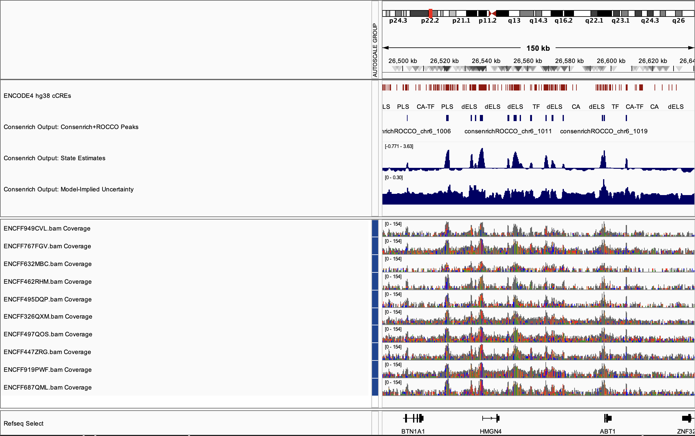
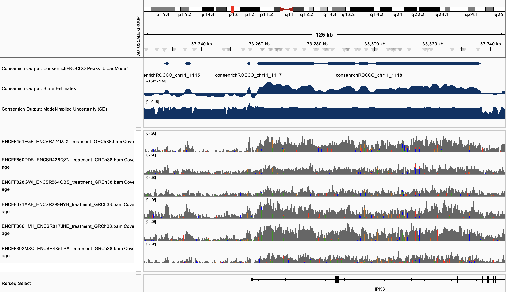

Quickstart + Usage
------------------

After installing Consenrich, run it from the command line with
``consenrich -h`` or import it from Python.
The examples below are intentionally short demos on a couple chromosomes.

.. _getting-started:

Getting Started: H3K27ac ChIP-seq
~~~~~~~~~~~~~~~~~~~~~~~~~~~~~~~~~

This minimal example estimates a consensus H3K27ac signal from four ENCODE
epidermis ChIP-seq experiments with matched input controls.

Input Data
""""""""""

.. list-table:: H3K27ac demo inputs
  :header-rows: 1
  :widths: 18 22 30 30

  * - Experiment
    - Biosample
    - H3K27ac alignment
    - Control alignment
  * - `ENCSR214UZE <https://www.encodeproject.org/experiments/ENCSR214UZE/>`_
    - Epidermis/Female/71
    - `ENCFF793ZHL.bam <https://www.encodeproject.org/files/ENCFF793ZHL/@@download/ENCFF793ZHL.bam>`_
    - `ENCFF444WVG.bam <https://www.encodeproject.org/files/ENCFF444WVG/@@download/ENCFF444WVG.bam>`_
  * - `ENCSR334DRN <https://www.encodeproject.org/experiments/ENCSR334DRN/>`_
    - Epidermis/Male/67
    - `ENCFF647VPO.bam <https://www.encodeproject.org/files/ENCFF647VPO/@@download/ENCFF647VPO.bam>`_
    - `ENCFF619NYP.bam <https://www.encodeproject.org/files/ENCFF619NYP/@@download/ENCFF619NYP.bam>`_
  * - `ENCSR340ZTB <https://www.encodeproject.org/experiments/ENCSR340ZTB/>`_
    - Epidermis/Female/80
    - `ENCFF809VKT.bam <https://www.encodeproject.org/files/ENCFF809VKT/@@download/ENCFF809VKT.bam>`_
    - `ENCFF898LKJ.bam <https://www.encodeproject.org/files/ENCFF898LKJ/@@download/ENCFF898LKJ.bam>`_
  * - `ENCSR386CKJ <https://www.encodeproject.org/experiments/ENCSR386CKJ/>`_
    - Epidermis/Male/75
    - `ENCFF295EFL.bam <https://www.encodeproject.org/files/ENCFF295EFL/@@download/ENCFF295EFL.bam>`_
    - `ENCFF490MWV.bam <https://www.encodeproject.org/files/ENCFF490MWV/@@download/ENCFF490MWV.bam>`_

Download Alignments
"""""""""""""""""""

Copy and paste the following into your terminal to download and index the BAM
files. You can use ``curl -L -O <URL>`` in place of ``wget <URL>`` if ``wget``
is not available.

.. code-block:: bash

  encodeFiles=https://www.encodeproject.org/files
  for file in ENCFF793ZHL ENCFF647VPO ENCFF809VKT ENCFF295EFL; do
      wget "$encodeFiles/$file/@@download/$file.bam"
  done
  for ctrl in ENCFF444WVG ENCFF619NYP ENCFF898LKJ ENCFF490MWV; do
      wget "$encodeFiles/$ctrl/@@download/$ctrl.bam"
  done
  samtools index -M *.bam

YAML Configuration
""""""""""""""""""

Save the following as ``demoHistoneChIPSeq.yaml`` in the directory containing
the BAM files:

.. code-block:: yaml
  :name: demoHistoneChIPSeq.yaml

  experimentName: demoHistoneChIPSeq

  genomeParams:
    name: hg38
    chromosomes: [chr21, chr22]
    excludeForNorm: [chrX, chrY]

  inputParams:
    samples:
      - name: H3K27ac_1
        path: ENCFF793ZHL.bam
        format: bam
        role: treatment
      - name: H3K27ac_2
        path: ENCFF647VPO.bam
        format: bam
        role: treatment
      - name: H3K27ac_3
        path: ENCFF809VKT.bam
        format: bam
        role: treatment
      - name: H3K27ac_4
        path: ENCFF295EFL.bam
        format: bam
        role: treatment
      - name: input_1
        path: ENCFF444WVG.bam
        format: bam
        role: control
      - name: input_2
        path: ENCFF619NYP.bam
        format: bam
        role: control
      - name: input_3
        path: ENCFF898LKJ.bam
        format: bam
        role: control
      - name: input_4
        path: ENCFF490MWV.bam
        format: bam
        role: control

Run Consenrich
""""""""""""""

.. code-block:: console
  :name: Run H3K27ac demo

  % consenrich --config demoHistoneChIPSeq.yaml --verbose

The run writes a state bedGraph, uncertainty bedGraph, state bigWig,
uncertainty bigWig, ROCCO narrowPeak file, and ROCCO gappedPeak file. With the
current package version, the principal output files are:

.. code-block:: text

  demoHistoneChIPSeq_consenrich_state.VERSION.bw
  demoHistoneChIPSeq_consenrich_uncertainty.VERSION.bw
  consenrichOutput_demoHistoneChIPSeq_state.VERSION_rocco.narrowPeak
  consenrichOutput_demoHistoneChIPSeq_state.VERSION_rocco.gappedPeak

.. _atac-demo:

ATAC-seq Demo
~~~~~~~~~~~~~

This demo estimates a consensus chromatin-accessibility signal from ten ENCODE
ATAC-seq alignments.

Download Alignments
"""""""""""""""""""

.. code-block:: bash

  encodeFiles=https://www.encodeproject.org/files
  for file in ENCFF326QXM ENCFF447ZRG ENCFF462RHM ENCFF495DQP ENCFF497QOS ENCFF632MBC ENCFF687QML ENCFF767FGV ENCFF919PWF ENCFF949CVL; do
      wget "$encodeFiles/$file/@@download/$file.bam"
  done
  samtools index -M *.bam

YAML Configuration
""""""""""""""""""

Save the following as ``atacDemo.yaml``:

.. code-block:: yaml
  :name: atacDemo.yaml

  experimentName: atacDemo

  genomeParams:
    name: hg38
    # chromosomes: [chr11, chr22] # faster: Uncomment and specify chromosomes
    excludeForNorm: [chrX, chrY]

  inputParams:
    bamFiles:
      - ENCFF326QXM.bam
      - ENCFF447ZRG.bam
      - ENCFF462RHM.bam
      - ENCFF495DQP.bam
      - ENCFF497QOS.bam
      - ENCFF632MBC.bam
      - ENCFF687QML.bam
      - ENCFF767FGV.bam
      - ENCFF919PWF.bam
      - ENCFF949CVL.bam

Run Consenrich
""""""""""""""

.. code-block:: console
  :name: Run ATAC demo

  % consenrich --config atacDemo.yaml --verbose

Principal output files:

.. code-block:: text

  atacDemo_consenrich_state.VERSION..bw
  atacDemo_consenrich_uncertainty.VERSION.bw
  consenrichOutput_atacDemo_state.VERSION_rocco.narrowPeak
  consenrichOutput_atacDemo_state.VERSION_rocco.gappedPeak

Results
"""""""

Broad Mark ChIP-seq Demo
~~~~~~~~~~~~~~~~~~~~~~~~

Download Alignments
"""""""""""""""""""

(This will take a while!)

.. code-block:: bash

  encodeFiles=https://www.encodeproject.org/files

  while read -r accession output; do
      wget -O "$output" "$encodeFiles/$accession/@@download/$accession.bam"
  done <<'EOF'
  ENCFF365LTV ENCFF365LTV_ENCSR449FRQ_treatment_GRCh38.bam
  ENCFF630KZV ENCFF630KZV_ENCSR678RFS_treatment_GRCh38.bam
  ENCFF851FLQ ENCFF851FLQ_ENCSR412THE_treatment_GRCh38.bam
  ENCFF581VRR ENCFF581VRR_ENCSR208XKJ_treatment_GRCh38.bam
  ENCFF451FGF ENCFF451FGF_ENCSR724MJX_treatment_GRCh38.bam
  ENCFF660DDB ENCFF660DDB_ENCSR438QZN_treatment_GRCh38.bam
  ENCFF828GWI ENCFF828GWI_ENCSR564QBS_treatment_GRCh38.bam
  ENCFF392MXC ENCFF392MXC_ENCSR485LPA_treatment_GRCh38.bam
  ENCFF366HMH ENCFF366HMH_ENCSR817JNE_treatment_GRCh38.bam
  ENCFF671AAF ENCFF671AAF_ENCSR299NYB_treatment_GRCh38.bam
  ENCFF536MLZ ENCFF536MLZ_ENCSR178FVP_control_GRCh38.bam
  ENCFF007LNN ENCFF007LNN_ENCSR632MPN_control_GRCh38.bam
  ENCFF422MKH ENCFF422MKH_ENCSR040TRJ_control_GRCh38.bam
  ENCFF525NLT ENCFF525NLT_ENCSR979YKY_control_GRCh38.bam
  ENCFF013ION ENCFF013ION_ENCSR109IWL_control_GRCh38.bam
  ENCFF730PAF ENCFF730PAF_ENCSR526EXI_control_GRCh38.bam
  ENCFF971XWL ENCFF971XWL_ENCSR945LPX_control_GRCh38.bam
  ENCFF273EYI ENCFF273EYI_ENCSR120ITZ_control_GRCh38.bam
  ENCFF944AYC ENCFF944AYC_ENCSR061EXX_control_GRCh38.bam
  ENCFF271VZL ENCFF271VZL_ENCSR261PLD_control_GRCh38.bam
  EOF

  samtools index -M *.bam

YAML Configuration
""""""""""""""""""

Save the following as ``bigH3K4me1Demo.yaml``:

.. code-block:: yaml
  :name: bigH3K4me1Demo.yaml

  experimentName: bigH3K4me1Demo

  genomeParams:
    name: hg38
    chromosomes: [chr21, chr22]
    excludeForNorm: [chrX, chrY]

  inputParams:
    samples:
      - name: ENCSR449FRQ_H3K4me1
        path: ENCFF365LTV_ENCSR449FRQ_treatment_GRCh38.bam
        format: bam
        role: treatment
      - name: ENCSR678RFS_H3K4me1
        path: ENCFF630KZV_ENCSR678RFS_treatment_GRCh38.bam
        format: bam
        role: treatment
      - name: ENCSR412THE_H3K4me1
        path: ENCFF851FLQ_ENCSR412THE_treatment_GRCh38.bam
        format: bam
        role: treatment
      - name: ENCSR208XKJ_H3K4me1
        path: ENCFF581VRR_ENCSR208XKJ_treatment_GRCh38.bam
        format: bam
        role: treatment
      - name: ENCSR724MJX_H3K4me1
        path: ENCFF451FGF_ENCSR724MJX_treatment_GRCh38.bam
        format: bam
        role: treatment
      - name: ENCSR438QZN_H3K4me1
        path: ENCFF660DDB_ENCSR438QZN_treatment_GRCh38.bam
        format: bam
        role: treatment
      - name: ENCSR564QBS_H3K4me1
        path: ENCFF828GWI_ENCSR564QBS_treatment_GRCh38.bam
        format: bam
        role: treatment
      - name: ENCSR485LPA_H3K4me1
        path: ENCFF392MXC_ENCSR485LPA_treatment_GRCh38.bam
        format: bam
        role: treatment
      - name: ENCSR817JNE_H3K4me1
        path: ENCFF366HMH_ENCSR817JNE_treatment_GRCh38.bam
        format: bam
        role: treatment
      - name: ENCSR299NYB_H3K4me1
        path: ENCFF671AAF_ENCSR299NYB_treatment_GRCh38.bam
        format: bam
        role: treatment

      - name: ENCSR178FVP_input_for_ENCSR449FRQ
        path: ENCFF536MLZ_ENCSR178FVP_control_GRCh38.bam
        format: bam
        role: control
      - name: ENCSR632MPN_input_for_ENCSR678RFS
        path: ENCFF007LNN_ENCSR632MPN_control_GRCh38.bam
        format: bam
        role: control
      - name: ENCSR040TRJ_input_for_ENCSR412THE
        path: ENCFF422MKH_ENCSR040TRJ_control_GRCh38.bam
        format: bam
        role: control
      - name: ENCSR979YKY_input_for_ENCSR208XKJ
        path: ENCFF525NLT_ENCSR979YKY_control_GRCh38.bam
        format: bam
        role: control
      - name: ENCSR109IWL_input_for_ENCSR724MJX
        path: ENCFF013ION_ENCSR109IWL_control_GRCh38.bam
        format: bam
        role: control
      - name: ENCSR526EXI_input_for_ENCSR438QZN
        path: ENCFF730PAF_ENCSR526EXI_control_GRCh38.bam
        format: bam
        role: control
      - name: ENCSR945LPX_input_for_ENCSR564QBS
        path: ENCFF971XWL_ENCSR945LPX_control_GRCh38.bam
        format: bam
        role: control
      - name: ENCSR120ITZ_input_for_ENCSR485LPA
        path: ENCFF273EYI_ENCSR120ITZ_control_GRCh38.bam
        format: bam
        role: control
      - name: ENCSR061EXX_input_for_ENCSR817JNE
        path: ENCFF944AYC_ENCSR061EXX_control_GRCh38.bam
        format: bam
        role: control
      - name: ENCSR261PLD_input_for_ENCSR299NYB
        path: ENCFF271VZL_ENCSR261PLD_control_GRCh38.bam
        format: bam
        role: control

  countingParams:
    intervalSizeBP: 100

  matchingParams:
    peakMode: broad

Run Consenrich
""""""""""""""

.. code-block:: console
  :name: Run H3K4me1 demo

  % consenrich --config bigH3K4me1Demo.yaml --verbose

Principal output files:

.. code-block:: text

  bigH3K4me1Demo_consenrich_state.VERSION.bw
  bigH3K4me1Demo_consenrich_uncertainty.VERSION.bw
  consenrichOutput_bigH3K4me1Demo_state.VERSION_rocco.narrowPeak
  consenrichOutput_bigH3K4me1Demo_state.VERSION_rocco.gappedPeak

Results
"""""""

