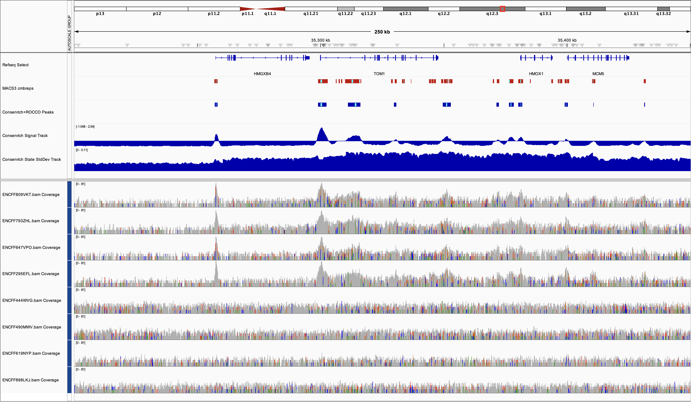

Quickstart + Usage
----------------------

.. toctree::
   :maxdepth: 1
   :caption: Quickstart + Usage
   :name: Usage

After installing Consenrich, you can run it via the command line (``consenrich -h``) or programmatically using the Python/Cython :ref:`API`.

.. _getting-started:

Getting Started: Minimal Example
~~~~~~~~~~~~~~~~~~~~~~~~~~~~~~~~~

.. toctree::
    :maxdepth: 2
    :caption: Getting Started
    :name: minimal

A brief analysis using H3K27ac (narrow) ChIP-seq data generated from human tissue samples is carried out for demonstration.

Input Data
"""""""""""""""""""""

The input data in this example consists of four donors' treatment and control samples (epidermal tissue) from ENCODE.

.. list-table:: Input Data
  :header-rows: 1
  :widths: 20 20 30 30

  * - Experiment
    - Biosample
    - H3K27ac Alignment
    - Control Alignment
  * - `ENCSR214UZE <https://www.encodeproject.org/experiments/ENCSR214UZE/>`_
    - Epidermis/Female/71
    - `ENCFF793ZHL.bam <https://www.encodeproject.org/files/ENCFF793ZHL/@@download/ENCFF793ZHL.bam>`_
    - `ENCFF444WVG.bam <https://www.encodeproject.org/files/ENCFF444WVG/@@download/ENCFF444WVG.bam>`_
  * - `ENCSR334DRN <https://www.encodeproject.org/experiments/ENCSR334DRN/>`_
    - Epidermis/Male/67
    - `ENCFF647VPO.bam <https://www.encodeproject.org/files/ENCFF647VPO/@@download/ENCFF647VPO.bam>`_
    - `ENCFF619NYP.bam <https://www.encodeproject.org/files/ENCFF619NYP/@@download/ENCFF619NYP.bam>`_
  * - `ENCSR340ZTB <https://www.encodeproject.org/experiments/ENCSR340ZTB/>`_
    - Epidermis/Female/80
    - `ENCFF809VKT.bam <https://www.encodeproject.org/files/ENCFF809VKT/@@download/ENCFF809VKT.bam>`_
    - `ENCFF898LKJ.bam <https://www.encodeproject.org/files/ENCFF898LKJ/@@download/ENCFF898LKJ.bam>`_
  * - `ENCSR386CKJ <https://www.encodeproject.org/experiments/ENCSR386CKJ/>`_
    - Epidermis/Male/75
    - `ENCFF295EFL.bam <https://www.encodeproject.org/files/ENCFF295EFL/@@download/ENCFF295EFL.bam>`_
    - `ENCFF490MWV.bam <https://www.encodeproject.org/files/ENCFF490MWV/@@download/ENCFF490MWV.bam>`_

Download Alignment Files from ENCODE
"""""""""""""""""""""""""""""""""""""""

Copy+paste the following to your terminal to download and index the BAM files for this demo.

You can also use ``curl -O <URL>`` in place of ``wget <URL>`` if the latter is not available on your system.

.. code-block:: bash

  encodeFiles=https://www.encodeproject.org/files
  for file in ENCFF793ZHL ENCFF647VPO ENCFF809VKT ENCFF295EFL; do
      wget "$encodeFiles/$file/@@download/$file.bam"
  done
  for ctrl in ENCFF444WVG ENCFF619NYP ENCFF898LKJ ENCFF490MWV; do
      wget "$encodeFiles/$ctrl/@@download/$ctrl.bam"
  done
  samtools index -M *.bam

Using a YAML Configuration file
"""""""""""""""""""""""""""""""""""""

.. tip::

   Refer to the ``<process,observation,etc.>Params`` classes in module in the :ref:`API` for complete documentation of configuration options.

Copy and paste the following YAML into a file named ``demoHistoneChIPSeq.yaml``:

.. code-block:: yaml
  :name: demoHistoneChIPSeq.yaml

  experimentName: demoHistoneChIPSeq

  genomeParams:
    name: hg38
    chromosomes: [chr21, chr22] # remove this line to run genome-wide
    excludeForNorm: [chrX, chrY]

  inputParams:
    bamFiles:
      - ENCFF793ZHL.bam
      - ENCFF647VPO.bam
      - ENCFF809VKT.bam
      - ENCFF295EFL.bam
    bamFilesControl:
      - ENCFF444WVG.bam
      - ENCFF619NYP.bam
      - ENCFF898LKJ.bam
      - ENCFF490MWV.bam

.. admonition:: Control Inputs
  :class: tip

  You can omit ``inputParams.bamFilesControl`` for ATAC-seq, DNase-seq, Cut&Run, and other assays where no input control is available or applicable.

Run Consenrich
"""""""""""""""""""""

.. code-block:: console
  :name: Run Consenrich

  % consenrich --config demoHistoneChIPSeq.yaml --verbose

Results
""""""""""""""""""""""""""

* We display Consenrich results (blue) over a 250 kb locus in human chromosome 22

