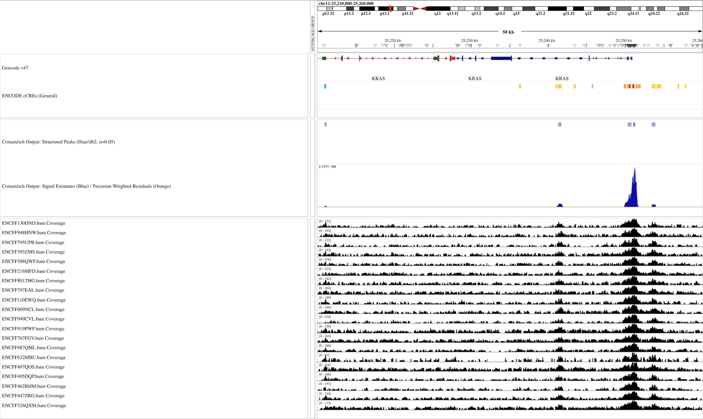

Quickstart + Usage
----------------------

.. toctree::
   :maxdepth: 1
   :caption: Quickstart + Usage
   :name: Usage

After installing Consenrich, you can run it via the command line (``consenrich -h``) or programmatically using the Python/Cython :ref:`API`.

We provide several usage examples below. See also :ref:`files` and :ref:`tips` for more information.

.. _getting-started:

Getting Started: Minimal Example
~~~~~~~~~~~~~~~~~~~~~~~~~~~~~~~~~

.. toctree::
    :maxdepth: 2
    :caption: Getting Started
    :name: minimal

A brief analysis using H3K27ac (narrow mark) ChIP-seq data is carried out for demonstration.

Input Data
"""""""""""""""""""""

The input data in this example consists of four donors' treatment and control samples (epidermal tissue) from ENCODE.

.. list-table:: Input Data
  :header-rows: 1
  :widths: 20 20 30 30

  * - Experiment
    - Biosample
    - H3K27ac Alignment
    - Control Alignment
  * - `ENCSR214UZE <https://www.encodeproject.org/experiments/ENCSR214UZE/>`_
    - Epidermis/Female/71
    - `ENCFF793ZHL.bam <https://www.encodeproject.org/files/ENCFF793ZHL/@@download/ENCFF793ZHL.bam>`_
    - `ENCFF444WVG.bam <https://www.encodeproject.org/files/ENCFF444WVG/@@download/ENCFF444WVG.bam>`_
  * - `ENCSR334DRN <https://www.encodeproject.org/experiments/ENCSR334DRN/>`_
    - Epidermis/Male/67
    - `ENCFF647VPO.bam <https://www.encodeproject.org/files/ENCFF647VPO/@@download/ENCFF647VPO.bam>`_
    - `ENCFF619NYP.bam <https://www.encodeproject.org/files/ENCFF619NYP/@@download/ENCFF619NYP.bam>`_
  * - `ENCSR340ZTB <https://www.encodeproject.org/experiments/ENCSR340ZTB/>`_
    - Epidermis/Female/80
    - `ENCFF809VKT.bam <https://www.encodeproject.org/files/ENCFF809VKT/@@download/ENCFF809VKT.bam>`_
    - `ENCFF898LKJ.bam <https://www.encodeproject.org/files/ENCFF898LKJ/@@download/ENCFF898LKJ.bam>`_
  * - `ENCSR386CKJ <https://www.encodeproject.org/experiments/ENCSR386CKJ/>`_
    - Epidermis/Male/75
    - `ENCFF295EFL.bam <https://www.encodeproject.org/files/ENCFF295EFL/@@download/ENCFF295EFL.bam>`_
    - `ENCFF490MWV.bam <https://www.encodeproject.org/files/ENCFF490MWV/@@download/ENCFF490MWV.bam>`_

Download Alignment Files from ENCODE
"""""""""""""""""""""""""""""""""""""""

Copy+paste the following to your terminal to download and index the BAM files for this demo.

You can also use ``curl -O <URL>`` in place of ``wget <URL>`` if the latter is not available on your system.

.. code-block:: bash

  encodeFiles=https://www.encodeproject.org/files
  for file in ENCFF793ZHL ENCFF647VPO ENCFF809VKT ENCFF295EFL; do
      wget "$encodeFiles/$file/@@download/$file.bam"
  done
  for ctrl in ENCFF444WVG ENCFF619NYP ENCFF898LKJ ENCFF490MWV; do
      wget "$encodeFiles/$ctrl/@@download/$ctrl.bam"
  done
  samtools index -M *.bam

Using a YAML Configuration file
"""""""""""""""""""""""""""""""""""""

.. tip::

   Refer to the ``<process,observation,etc.>Params`` classes in module in the :ref:`API` for complete documentation of configuration options.

Copy and paste the following YAML into a file named ``demoHistoneChIPSeq.yaml``. For a quick trial run (:math:`\approx` 1 minute), you can restrict analysis to a subset of chromosomes: To reproduce the results shown in the browser snapshot, add ``genomeParams.chromosomes: [chr21, chr22]`` to the configuration file.

.. code-block:: yaml
  :name: demoHistoneChIPSeq.yaml

  experimentName: demoHistoneChIPSeq
  genomeParams.name: hg38
  genomeParams.chromosomes: [chr21, chr22] # remove to run genome-wide
  genomeParams.excludeForNorm: [chrX, chrY]

  inputParams.bamFiles: [ENCFF793ZHL.bam,
  ENCFF647VPO.bam,
  ENCFF809VKT.bam,
  ENCFF295EFL.bam]

  inputParams.bamFilesControl: [ENCFF444WVG.bam,
  ENCFF619NYP.bam,
  ENCFF898LKJ.bam,
  ENCFF490MWV.bam]

  # Optional: call 'structured peaks' via `consenrich.matching`
  matchingParams.templateNames: [haar, db2]
  matchingParams.cascadeLevels: [3, 3]
  matchingParams.minMatchLengthBP: -1
  matchingParams.mergeGapBP: 250

.. admonition:: Control Inputs
  :class: tip

  Omit ``inputParams.bamFilesControl`` for ATAC-seq, DNase-seq, Cut&Run, and other assays where no control is available or applicable.

Run Consenrich
"""""""""""""""""""""

.. admonition:: Guidance: Command-line vs. Programmatic Usage
  :class: tip
  :collapsible: closed

  The command-line interface is a convenience wrapper that may not expose all available objects or more niche features.
  Some users may find it beneficial to run Consenrich programmatically (e.g., in a Jupyter notebook, Python script), as the :ref:`API` enables
  greater flexibility to apply custom preprocessing steps and various context-specific protocols within existing workflows.

.. code-block:: console
  :name: Run Consenrich

  % consenrich --config demoHistoneChIPSeq.yaml --verbose

Results
""""""""""""""""""""""""""

* We display Consenrich results (blue) at ``APOL2 <--| |--> APOL1``

* For reference, ENCODE peaks for the same `Experiments` and donor samples are included (black):
  * `Histone ChIP-seq (unreplicated) <https://www.encodeproject.org/pipelines/ENCPL841HGV/>`_ (MACS2 calls,  partition concordance)

.. image:: ../images/ConsenrichIGVdemoHistoneChIPSeq.png
  :alt: Output Consenrich Signal Estimates
    :width: 700px
    :align: left

.. _additional-examples:

Additional Examples and Benchmarking
~~~~~~~~~~~~~~~~~~~~~~~~~~~~~~~~~~~~~~~~~~~~~~~~~~~~

.. toctree::
   :maxdepth: 2
   :caption: Additional Examples and Computational Benchmarking

This section of the documentation will be regularly updated to include a breadth of assays, downstream analyses, and runtime benchmarks.

ATAC-seq
""""""""""""""""

- Input data (`atac20`): :math:`m=20` ATAC-seq BAM files derived from lymphoblastoid cell lines (ENCODE)
- Varying data quality (e.g., `Extremely low read depth <https://www.encodeproject.org/data-standards/audits/#extremely_low_read_depth>`_)

Environment
''''''''''''''

- MacBook MX313LL/A (arm64)
- Python `3.12.9`
- Consenrich `v0.7.1b1`
- `HTSlib (Samtools) <https://www.htslib.org/>`_ 1.22.1
- `Bedtools <https://bedtools.readthedocs.io/en/latest/>`_ 2.31.1

Names and versions of packages that are relevant to computational performance. These specific versions are *not required* but are included for reproducibility.

.. list-table::
     :header-rows: 1
     :widths: 40 60

     * - Package
       - Version
     * - ``cython``
       - 3.1.4
     * - ``numpy``
       - 2.3.3
     * - ``scipy``
       - 1.16.2

Configuration
''''''''''''''''''''''''''''

Run with the following YAML config file `atac20Benchmark.yaml`. Note that several parameters are listed and/or adjusted for demonstration purposes.

Note that globs, e.g., `*.bam`, are allowed, but the BAM file names are listed explicitly in the config to show their ENCODE accessions for reference.

.. code-block:: yaml

  experimentName: atac20Benchmark
  genomeParams.name: hg38
  genomeParams.excludeChroms: ['chrY']
  genomeParams.excludeForNorm: ['chrX', 'chrY']
  inputParams.bamFiles: [
    ENCFF326QXM.bam,
    ENCFF497QOS.bam,
    ENCFF919PWF.bam,
    ENCFF447ZRG.bam,
    ENCFF632MBC.bam,
    ENCFF949CVL.bam,
    ENCFF462RHM.bam,
    ENCFF687QML.bam,
    ENCFF495DQP.bam,
    ENCFF767FGV.bam,
    ENCFF009NCL.bam,
    ENCFF110EWQ.bam,
    ENCFF797EAL.bam,
    ENCFF801THG.bam,
    ENCFF216MFD.bam,
    ENCFF588QWF.bam,
    ENCFF795UPB.bam,
    ENCFF395ZMS.bam,
    ENCFF130DND.bam,
    ENCFF948HNW.bam
  ]

  matchingParams.templateNames: [haar, db2]
  matchingParams.cascadeLevels: [2, 2]

Run Consenrich
''''''''''''''''''''

.. code-block:: console

  % consenrich --config atac20Benchmark.yaml --verbose

Results
''''''''''''''''''''''''''''

Consenrich outputs are visualized over a 50kb genomic region centered around `LYL1`.

**Evaluating Structured Peak Results: cCRE Overlaps**

We measure overlap between the Consenrich-detected regions and previously-identified candidate regulatory elements (`ENCODE4 GRCh38 cCREs <https://screen.wenglab.org/downloads>`_).

Note that the ENCODE cCREs are not specific to our lymphoblastoid input dataset (`atac20`) and strict concordance is not expected. Nonetheless, given the breadth of cell types and tissues surveyed in ENCODE, a substantial overlap between Consenrich-detected structured peaks and cCREs is desirable.

* We first count:

  - The total number of Consenrich-detected structured peaks (183,449)
  - The number of *unique* Consenrich-detected structured peaks sharing at least a :math:`25\%` *reciprocal* overlap with an ENCODE4 cCRE (163,511)

  .. code-block:: console

    % bedtools intersect \
      -a consenrichOutput_atac20Benchmark_matches.mergedMatches.narrowPeak \
      -b GRCh38-cCREs.bed \
      -f 0.25 -r -u \
      | wc -l

* We also evaluate overlaps compared to a null baseline:

  |    *Controlling for feature size and chromosome placement, how many cCRE overlaps would we expect by randomly selecting 183,449 regions?*

  We invoke `bedtools shuffle <https://bedtools.readthedocs.io/en/latest/content/tools/shuffle.html>`_,

  .. code-block:: console

    % bedtools shuffle \
      -i consenrichOutput_atac20Benchmark_matches.mergedMatches.narrowPeak \
      -g hg38.sizes \
      -chrom \
      | bedtools intersect -a stdin -b GRCh38-cCREs.bed -f 0.25 -r -u \
      | wc -l

  and aggregate results for `N=250` independent trials to build an empirical distribution for cCRE-hits under our null model.

We find a substantial overlap between Consenrich-detected regions and cCREs, with a significant enrichment versus null hits (3 :math:`\times` fold-change, :math:`\hat{p} \approx 0.0039`):

+------------------------------------------------------------------------------------------+----------------------------------------------+
| Feature                                                                                  | Value                                        |
+==========================================================================================+==============================================+
| Consenrich: Total structured peaks (α=0.05)                                              | 183,449                                      |
+------------------------------------------------------------------------------------------+----------------------------------------------+
| Consenrich: Distinct cCRE overlaps*                                                      | 163,511                                      |
+------------------------------------------------------------------------------------------+----------------------------------------------+
| Consenrich: Percent overlapping                                                          | **89.1%**                                    |
+------------------------------------------------------------------------------------------+----------------------------------------------+
| Random (``shuffle``): Distinct cCRE overlaps*                                            | μ ≈ 54,806.6,  σ ≈ 190.6                     |
+------------------------------------------------------------------------------------------+----------------------------------------------+
| Random (``shuffle``): Percent overlapping                                                | ≈ **29.8%**                                  |
+------------------------------------------------------------------------------------------+----------------------------------------------+

:math:`\ast`: ``bedtools intersect -f 0.25 -r -u``

.. _runtimeAndMemoryProfilingAtac20:

Runtime and Memory Profiling
''''''''''''''''''''''''''''''''''

Memory was profiled using the package `memory-profiler <https://pypi.org/project/memory-profiler/>`_. See the plot below for memory usage over time. Function calls are marked as notches.

Note that the repeated sampling of memory every 0.1 seconds during profiling introduces some overhead that affects runtime.

.. image:: ../benchmarks/atac20/images/atac20BenchmarkMemoryPlot.png
    :alt: Time vs. Memory Usage (`memory-profiler`)
    :width: 800px
    :align: center

----

ChIP-seq: Broad Histone Marks
"""""""""""""""""""""""""""""""""""""""""""""

In this example, we look for *dual-marked H3K36me3/H3K9me3 enrichments*

As input data, we use per-mark ChIP-seq samples from the `ENTEx Project: Four Reference Epigenomes <http://entex.encodeproject.org/>`_.

- H3K36me3: :math:`m=4` H3K36me3 ChIP-seq BAM files + matched controls from lung tissue of four donors (single-end)
- H3K9me3: :math:`m=4` H3K9me3 ChIP-seq BAM files + matched controls from lung tissue of four donors (single-end)

Environment
''''''''''''''''

- MacBook MX313LL/A (arm64)
- Python 3.12.9
- Consenrich v0.7.1b1
- `HTSlib (Samtools) <https://www.htslib.org/>`_ 1.21
- `Bedtools <https://bedtools.readthedocs.io/en/latest/>`_ 2.31.1

Names and versions of packages that are relevant to computational performance. These specific versions are *not required* but are included for reproducibility.

.. list-table::
     :header-rows: 1
     :widths: 40 60

     * - Package
       - Version
     * - ``cython``
       - 3.1.4
     * - ``numpy``
       - 2.3.3
     * - ``scipy``
       - 1.16.2

Configuration
''''''''''''''''''''''''''''

We run Consenrich separately for H3K36me3 and H3K9me3.

* ``entexFourH3K36me3.yaml``.

  .. code-block:: yaml

    experimentName: entexFourH3K36me3
    genomeParams.name: hg38
    genomeParams.excludeChroms: [chrY]
    genomeParams.excludeForNorm: [chrX, chrY]

    inputParams.bamFiles: [ENCFF441SHP.bam,
     ENCFF450ORQ.bam,
     ENCFF903UTS.bam,
     ENCFF790HIV.bam
     ]

    inputParams.bamFilesControl: [ENCFF794QJK.bam,
     ENCFF831MFQ.bam,
     ENCFF660HBS.bam,
     ENCFF430OFG.bam
    ]

    matchingParams.templateNames: [haar, db2]
    matchingParams.cascadeLevels: [3, 3]
    matchingParams.mergeGapBP: 250

* ``entexFourH3K9me3.yaml``.

  .. code-block:: yaml

    experimentName: entexFourH3K9me3
    genomeParams.name: hg38
    genomeParams.excludeChroms: [chrY]
    genomeParams.excludeForNorm: [chrX, chrY]

    inputParams.bamFiles: [ENCFF887THR.bam,
      ENCFF894WAK.bam,
      ENCFF337ZUU.bam,
      ENCFF775OLD.bam
    ]

    inputParams.bamFilesControl: [ENCFF794QJK.bam,
     ENCFF831MFQ.bam,
     ENCFF660HBS.bam,
     ENCFF430OFG.bam
    ]

    observationParams.useALV: true # recommended for heterochromatic marks
    matchingParams.templateNames: [haar, db2]
    matchingParams.cascadeLevels: [3, 3]
    matchingParams.mergeGapBP: 250

.. admonition:: Parameter Adjustments for Broad Marks
  :class: tip
  :collapsible: closed

  If higher-detail/narrow features are not desirable, several options can be adjusted to emphasize broader trends in the data.

  This may be relevant for certain histone modifications and other settings where signal:background ratios are comparably low.

  .. code-block:: yaml

    # Default is 25, increase to emphasize lower-detail, broader trends
    countingParams.stepSize: 50

    matchingParams.templateNames: [haar]
    matchingParams.cascadeLevels: [3]
    matchingParams.minMatchLengthBP: -1 # compute as avg. non-zero contig.
    matchingParams.mergeGapBP: 500

Run Consenrich
''''''''''''''''''''''''''''

Significant matches/peaks for each mark are intersected to identify dual-marked regions.

.. code-block:: console

  % consenrich --config entexFourH3K36me3.yaml --verbose
  % consenrich --config entexFourH3K9me3.yaml --verbose
  % bedtools intersect \
      -a consenrichOutput_entexFourH3K36me3_matches.mergedMatches.narrowPeak \
      -b consenrichOutput_entexFourH3K9me3_matches.mergedMatches.narrowPeak \
      -f 0.25 -r -u -sortout | cut -f 1-3 > Consenrich_StructuredPeaks_H3K9me3_AND_H3K36me3.bed

Results
''''''''''''''''''''''''''''

Consistent with `previous studies <https://pmc.ncbi.nlm.nih.gov/search/?term=dual+H3K9me3+H3K36me3+%22zinc+finger%22&sort=relevance>`_, we observe a notable density of H3K9me3/H3K36me3 intersections in ZNF gene clusters.

Each sample's alignment coverage tracks, and the corresponding Consenrich-generated outputs, are visualized over `ZNF615` below in the UCSC Genome Browser (20 kb).

.. image:: ../benchmarks/H3K36me3/images/Consenrich_ENTexFour_DualMark.png
    :alt: H3K36me3 Intron-Exon
    :width: 800px
    :align: left

Peaks detected using `ENCODE's histone ChIP-seq pipeline <https://www.encodeproject.org/pipelines/ENCPL841HGV/>`_ for each experiment/mark are also displayed, prefixed by ``REF``. Experiment and/or file accessions for each resource are labelled.

.. _files:

File Formats
~~~~~~~~~~~~~~~~~~~~~~

* Input

  * Per-sample sequence alignment files (BAM format)

    * *Optional*: Control/input alignment files (e.g., ChIP-seq)

  * Note, if using Consenrich programmatically, users can provide preprocessed sample-by-interval count matrices directly instead of BAM files (see :func:`consenrich.core.runConsenrich`)

* Output

  * *Signal estimate track*: ``<experimentName>_consenrich_state.bw``

    * This track records genome-wide Consenrich estimates for the targeted signal of interest
    * A human-readable bedGraph file is also generated: ``consenrichOutput_<experimentName>_consenrich_state.bedGraph``

  * *Precision-weighted residual track*: ``<experimentName>_consenrich_residuals.bw``

    * This track records genome-wide differences between (*a*) Consenrich estimates and (*b*) observed sample data -- after accounting for regional + sample-specific uncertainty.
    * A human-readable bedGraph file is also generated: ``consenrichOutput_<experimentName>_consenrich_residuals.bedGraph``

  * *Structured peak calls* (Optional): ``<experimentName>_matches.mergedMatches.narrowPeak``

    * BED-like annotation of enriched signal regions showing a regular structure. Only generated if the matching algorithm is invoked.
    * See :ref:`matching` and :func:`consenrich.matching.matchWavelet`

.. _tips:

Miscellaneous Guidance
~~~~~~~~~~~~~~~~~~~~~~~~~~

Consensus Peak Calling + Downstream Differential Analyses
""""""""""""""""""""""""""""""""""""""""""""""""""""""""""""""

Consenrich can improve between-group differential analyses that depend on a good set of initial 'candidate' consensus peaks (see `Enhanced Consensus Peak Calling and Differential Analyses in Complex Human Disease <https://www.biorxiv.org/content/10.1101/2025.02.05.636702v2>`_ in the manuscript preprint.)

`ROCCO <https://github.com/nolan-h-hamilton/ROCCO>`_ can accept Consenrich bigWig files as input and is well-suited to leverage high-resolution signal estimates while balancing regularity in a manner that is useful for simultaneous broad/narrow peak calling, particularly for open chromatin assays (e.g., ATAC-seq, DNase-seq).

For example, to run the `Consenrich+ROCCO` protocol used in the manuscript,

.. code-block:: console

 % python -m pip install rocco --upgrade
 % rocco -i <experimentName>_consenrich_state.bw \
    -g hg38 -o consenrichRocco_<experimentName>.bed \
    <...>

The budgeted/total-variation-regularized optimization procedure performed by ROCCO to select consensus peak regions prevents excessive multiple comparisons downstream and enforces biological plausibility. Other peak calling methods---including the :ref:`matching` algorithm packaged with Consenrich---that accept bedGraph or bigWig input (e.g., `MACS' bdgpeakcall <https://macs3-project.github.io/MACS/docs/bdgpeakcall.html>`_) may also prove viable, but only Consenrich+ROCCO has been extensively benchmarked for differential analyses to date.

Matching Algorithm: Command-line Usage
""""""""""""""""""""""""""""""""""""""""""""""""""""""""""""""

To avoid a full run/rerun of Consenrich when calling structured peaks, the matching algorithm can be run directly at the command-line on existing Consenrich-generated bedGraph files. For example:

.. code-block:: console

  % consenrich \
    --match-bedGraph consenrichOutput_<experimentName>_state.bedGraph \
    --match-template haar \
    --match-level 3 \
    --match-alpha 0.01

This calls structured peaks with a Haar template/level 3 and significance threshold :math:`\alpha=0.01`. Run ``consenrich -h`` for additional options.

For more details on the matching algorithm in general, see :ref:`matching` and :func:`consenrich.matching.matchWavelet` for more details.

Heterochromatic or Repressive targets
""""""""""""""""""""""""""""""""""""""""""""""""""""""""""""""""""""""

When targeting signals associated with *heterochromatin/repression* (e.g., H3K9me3 ChIP-seq/CUT&RUN, H3K27me3 ChIP-seq/CUT&RUN, MNase-seq), consider setting ``observationParams.useALV: true`` in the YAML configuration file.
This mitigates the risk of real signal being attributed to noise and may be consequential for higher-resolution analyses. See :class:`consenrich.core.observationParams` for more details.

