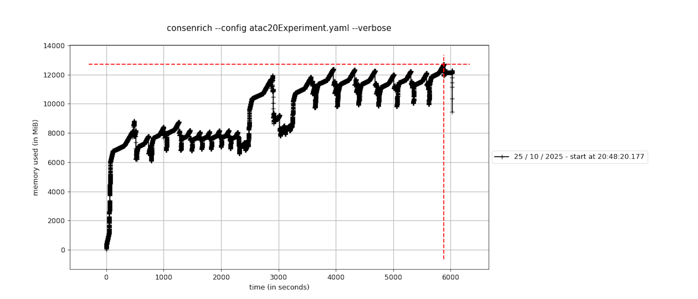

Quickstart + Usage
----------------------

.. toctree::
   :maxdepth: 1
   :caption: Quickstart + Usage
   :name: Usage

After installing Consenrich, you can run it via the command line (``consenrich -h``) or programmatically using the Python/Cython :ref:`API`.

.. _getting-started:

Getting Started: Minimal Example
~~~~~~~~~~~~~~~~~~~~~~~~~~~~~~~~~

.. toctree::
    :maxdepth: 2
    :caption: Getting Started
    :name: minimal

Here, a brief analysis using H3K27ac (narrow mark) ChIP-seq data is carried out for demonstration.

Input Data
"""""""""""""""""""""

The input data in this example consists of four donors' treatment and control samples (epidermal tissue) from ENCODE.

.. list-table:: Input Data
  :header-rows: 1
  :widths: 20 20 30 30

  * - Experiment
    - Biosample
    - H3K27ac Alignment
    - Control Alignment
  * - `ENCSR214UZE <https://www.encodeproject.org/experiments/ENCSR214UZE/>`_
    - Epidermis/Female/71
    - `ENCFF793ZHL.bam <https://www.encodeproject.org/files/ENCFF793ZHL/@@download/ENCFF793ZHL.bam>`_
    - `ENCFF444WVG.bam <https://www.encodeproject.org/files/ENCFF444WVG/@@download/ENCFF444WVG.bam>`_
  * - `ENCSR334DRN <https://www.encodeproject.org/experiments/ENCSR334DRN/>`_
    - Epidermis/Male/67
    - `ENCFF647VPO.bam <https://www.encodeproject.org/files/ENCFF647VPO/@@download/ENCFF647VPO.bam>`_
    - `ENCFF619NYP.bam <https://www.encodeproject.org/files/ENCFF619NYP/@@download/ENCFF619NYP.bam>`_
  * - `ENCSR340ZTB <https://www.encodeproject.org/experiments/ENCSR340ZTB/>`_
    - Epidermis/Female/80
    - `ENCFF809VKT.bam <https://www.encodeproject.org/files/ENCFF809VKT/@@download/ENCFF809VKT.bam>`_
    - `ENCFF898LKJ.bam <https://www.encodeproject.org/files/ENCFF898LKJ/@@download/ENCFF898LKJ.bam>`_
  * - `ENCSR386CKJ <https://www.encodeproject.org/experiments/ENCSR386CKJ/>`_
    - Epidermis/Male/75
    - `ENCFF295EFL.bam <https://www.encodeproject.org/files/ENCFF295EFL/@@download/ENCFF295EFL.bam>`_
    - `ENCFF490MWV.bam <https://www.encodeproject.org/files/ENCFF490MWV/@@download/ENCFF490MWV.bam>`_

Download Alignment Files from ENCODE
"""""""""""""""""""""""""""""""""""""""

Copy+paste the following to your terminal to download and index the BAM files for this demo.

You can also use ``curl -O <URL>`` in place of ``wget <URL>`` if the latter is not available on your system.

.. code-block:: bash

  encodeFiles=https://www.encodeproject.org/files

  for file in ENCFF793ZHL ENCFF647VPO ENCFF809VKT ENCFF295EFL; do
      wget "$encodeFiles/$file/@@download/$file.bam"
  done

  for ctrl in ENCFF444WVG ENCFF619NYP ENCFF898LKJ ENCFF490MWV; do
      wget "$encodeFiles/$ctrl/@@download/$ctrl.bam"
  done

  samtools index -M *.bam

Using a YAML Configuration file
"""""""""""""""""""""""""""""""""""""

.. tip::

   Refer to the ``<process,observation,etc.>Params`` classes in module in the :ref:`API` for complete documentation of configuration options.

Copy and paste the following YAML into a file named ``demoHistoneChIPSeq.yaml``. For a quick trial run (:math:`\approx` 1 minute), you can restrict analysis to a subset of chromosomes: To reproduce the results shown in the IGV browser snapshot below add ``genomeParams.chromosomes: [chr21, chr22]`` to the configuration file.

.. code-block:: yaml
  :name: demoHistoneChIPSeq.yaml

  experimentName: demoHistoneChIPSeq
  genomeParams.name: hg38
  genomeParams.chromosomes: [chr21, chr22] # remove this line to run genome-wide
  genomeParams.excludeForNorm: [chrX, chrY]

  inputParams.bamFiles: [ENCFF793ZHL.bam,
  ENCFF647VPO.bam,
  ENCFF809VKT.bam,
  ENCFF295EFL.bam]

  inputParams.bamFilesControl: [ENCFF444WVG.bam,
  ENCFF619NYP.bam,
  ENCFF898LKJ.bam,
  ENCFF490MWV.bam]

  # Optional: call 'structured peaks'
  matchingParams.templateNames: [haar, db2]

.. admonition:: Control Inputs
  :class: tip

  Omit ``inputParams.bamFilesControl`` for ATAC-seq, DNase-seq, Cut&Run, and other assays where no control is available or applicable.

Run Consenrich
"""""""""""""""""""""

Invoke the command-line interface to run Consenrich:

.. code-block:: bash
  :name: Run Consenrich

  consenrich --config demoHistoneChIPSeq.yaml --verbose

.. admonition:: Guidance: Command-line vs. Programmatic Usage
  :class: tip
  :collapsible: closed

  The command-line interface is a convenience wrapper that may not expose all available objects or more niche features.
  Some users may find it beneficial to run Consenrich programmatically (via Jupyter notebooks, Python scripts), as the :ref:`API` enables
  greater flexibility to apply custom preprocessing steps and various context-specific protocols within existing workflows.

Output Files and Formats
"""""""""""""""""""""""""""""""""

Consenrich generates the following output files:

* *Signal estimate track* (`bigWig <https://genome.ucsc.edu/goldenPath/help/bedgraph.html>`_): ``<experimentName>_consenrich_state.bw``

  * This track contains the primary estimated signal :math:`\widetilde{x}_{[i]},~i=1,\ldots,n`, derived from the input BAM files.
  * See :func:`consenrich.core.getPrimaryState`

* *Precision-weighted residual track* (`bigWig <https://genome.ucsc.edu/goldenPath/help/bedgraph.html>`_): ``<experimentName>_consenrich_residuals.bw``

  * These values reflect deviance from the primary state estimates after accounting for varying data quality.
  * See :func:`consenrich.core.getPrecisionWeightedResidual`

* If the matching algorithm is invoked to detect 'structured peaks', then Consenrich will also produce `BED/narrowPeak <https://genome.ucsc.edu/FAQ/FAQformat.html#format12>`_ output:

  * ``consenrichOutput_<experimentName>_matches.narrowPeak``: All matched regions, potentially overlapping.
  * ``consenrichOutput_<experimentName>_matches.mergedMatches.narrowPeak``: Merged matched regions, where the overlapping feature with the strongest signal determines the new pointSource/Summit.
  * See :ref:`matching` and :func:`consenrich.matching.matchWavelet`

.. admonition:: Guidance: `Consenrich+ROCCO`: Consensus Peak Calling
  :class: tip
  :collapsible: closed

  Consenrich can markedly improve conventional consensus peak calling and between-group differential analyses (e.g., *Enhanced Consensus Peak Calling and Differential Analyses in Complex Human Disease* in the `manuscript preprint <https://www.biorxiv.org/content/10.1101/2025.02.05.636702v2>`_)

  `ROCCO <https://github.com/nolan-h-hamilton/ROCCO>`_ can accept Consenrich bigWig files as input and is particularly well-suited to leverage high-resolution signal estimates while balancing regularity in a manner that is useful for simultaneous broad/narrow peak calling.

  In the example above, to call peaks using the `Consenrich+ROCCO` protocol,

  .. code-block:: console

	  python -m pip install rocco --upgrade
	  rocco -i demoHistoneChIPSeq_consenrich_state.bw -g hg38 -o consenrichRocco_demoHistoneChIPSeq.bed

  * The :ref:`matching` algorithm available with Consenrich may be effective as a complement or substitute for existing peak calling methods---e.g., detecting 'structured' enrichment patterns across multiple samples or identifying subpeaks within broad regions of interest.

  * Alternative peak calling methods that accept bedGraph or bigWig input (e.g., `MACS' bdgpeakcall <https://macs3-project.github.io/MACS/docs/bdgpeakcall.html>`_) should be capable of utilizing Consenrich signal tracks. Only ROCCO has been evaluated for this task to date.

Results
""""""""""""""""""""""""""

We display results at a **50kb** enhancer-rich region overlapping `MYH9`.

.. image:: ../images/ConsenrichIGVdemoHistoneChIPSeq.png
  :alt: Output Consenrich Signal Estimates
    :width: 800px
    :align: left

The input alignment coverage tracks (Black) and ``fold change over control`` bigWig files for each sample (Dark red) are displayed for reference with ENCODE's default signal quantification protocol.

Further analyses and practical guidance are available in :ref:`additional-examples`.

.. _additional-examples:

Additional Examples and Benchmarking
~~~~~~~~~~~~~~~~~~~~~~~~~~~~~~~~~~~~~~~~~~~~~~~~~~~~

.. toctree::
   :maxdepth: 2
   :caption: Additional Examples and Computational Benchmarking

This section of the documentation will be regularly updated to include a breadth of assays, downstream analyses, and runtime benchmarks.

ATAC-seq
""""""""""""""""

- Input data: :math:`m=20` ATAC-seq BAM files derived from lymphoblastoid cell lines (ENCODE)

Environment
''''''''''''''

- MacBook MX313LL/A (arm64)
- Python 3.12.9
- `HTSlib (Samtools) <https://www.htslib.org/>`_ 1.21
- `Bedtools <https://bedtools.readthedocs.io/en/latest/>`_ 2.31.1

Names and versions of packages that are relevant to computational performance. These specific versions are *not required* but are included for reproducibility.

.. list-table::
     :header-rows: 1
     :widths: 40 60

     * - Package
       - Version
     * - ``cython``
       - 3.1.2
     * - ``numpy``
       - 2.3.2
     * - ``scipy``
       - 1.16.1

Configuration
''''''''''''''''''''''''''''

Run with the following YAML config file `atac20Benchmark.yaml`. Note that globs, e.g., `*.bam`, are allowed, but the BAM file names are listed here explicitly to show their ENCODE accessions.

.. admonition:: Guidance: Tuning Memory Usage vs. Runtime
  :class: tip
  :collapsible: closed

  Consenrich is generally memory-efficient and can be run on large datasets using only consumer grade hardware (See :ref:`runtimeAndMemoryProfilingAtac20`). Memory cost can be reduced by decreasing `samParams.chunkSize` in the configuration file. Smaller chunk sizes may affect runtime due to overhead from more frequent file I/O, however.
  Note that the values in ``atac20Benchmark.yaml`` are defaults but are listed here explicitly.

.. admonition:: Guidance: Balancing Confidence in Noisy Data versus *a priori* Model Predictions
  :class: tip
  :collapsible: closed

  - Increasing ``processParams.minQ``:

    .. math::

      \textsf{Consenrich attributes more uncertainty to propagated predictions } \rightarrow \textsf{ data favored in estimation}

    - In other words, *restrict influence of the a priori model of signal/variance propagation across genomic positions to accommodate confidence in the data*

  - Increasing ``observationParams.minR``:

    .. math::

      \textsf{Consenrich attributes more uncertainty to the data } \rightarrow \textsf{ propagated predictions favored in estimation}

    - In other words, *restrict reliance on data to accommodate confidence in the a priori model of signal/variance propagation across positions*

  Note that default values should suffice for many cases given the adaptive noise models, but these parameters may be tuned in cases where the process model or the observation model is consistently more/less reliable than the other.

.. code-block:: yaml

  experimentName: atac20Benchmark
  genomeParams.name: hg38
  genomeParams.excludeChroms: ['chrX','chrY']
  genomeParams.excludeForNorm: ['chrX', 'chrY']
  inputParams.bamFiles: [
    ENCFF326QXM.bam,
    ENCFF497QOS.bam,
    ENCFF919PWF.bam,
    ENCFF447ZRG.bam,
    ENCFF632MBC.bam,
    ENCFF949CVL.bam,
    ENCFF462RHM.bam,
    ENCFF687QML.bam,
    ENCFF495DQP.bam,
    ENCFF767FGV.bam,
    ENCFF009NCL.bam,
    ENCFF110EWQ.bam,
    ENCFF797EAL.bam,
    ENCFF801THG.bam,
    ENCFF216MFD.bam,
    ENCFF588QWF.bam,
    ENCFF795UPB.bam,
    ENCFF395ZMS.bam,
    ENCFF130DND.bam,
    ENCFF948HNW.bam
  ]

  # Guidance: Balancing Confidence in the Modeled Process vs. Data
  processParams.minQ: 0.05 # clip process noise level above this value
  observationParams.minR: 0.05 # clip sample noise levels above this value

  # Guidance: Tuning Memory Usage vs. Runtime
  samParams.samThreads: 1 # default value
  samParams.chunkSize: 1000000 # default value

  # Optional: call 'structured peaks'
  matchingParams.templateNames: [haar, db2]

Run Consenrich
''''''''''''''''''''

.. code-block:: console

  consenrich --config atac20Benchmark.yaml --verbose

Results
''''''''''''''''''''''''''''

- Output tracks and features are visualized above in a **100kb** region around the transcription start site of `NOTCH1`.

.. image:: ../benchmarks/atac20/images/atac20BenchmarkIGVSpib.png
    :alt: IGV Browser Snapshot
    :width: 800px
    :align: left

Structured peak calls are positioned above the Consenrich signal as BED features in narrowPeak format.

- Focused view over a **25kb** subregion:

.. image:: ../benchmarks/atac20/images/atac20BenchmarkIGVSpib25KB.png
    :alt: IGV Browser Snapshot (25kb)
    :width: 800px
    :align: left

Evaluating Structured Peak Results
''''''''''''''''''''''''''''''''''''''''''''

We compare the structured peaks detected using :func:`consenrich.matching.matchWavelet` with previously identified candidate regulatory elements (ENCODE cCREs).

Consenrich-detected structured peaks that share a :math:`50\%` *reciprocal* overlap with an ENCODE cCRE are counted. Note that the cCREs are a general reference and are not specific to our lymphoblastoid input dataset, `atac20`.

.. code-block:: console

  bedtools intersect -a consenrichOutput_atac20Benchmark_matches.narrowPeak \
    -b ENCODE3_cCREs.bed \
    -f 0.50 -r -u  \
    | wc -l
    85072

+--------------------------------------------------+------------------------+
| Features                                         | Count                  |
+==================================================+========================+
| Consenrich-detected structured peaks             | **108,760**            |
+--------------------------------------------------+------------------------+
| Distinct cCRE overlaps (`-f 0.50 -r -u` )        | **85,072**             |
+--------------------------------------------------+------------------------+
| Fraction overlapping (%)                         | **78.2%**              |
+--------------------------------------------------+------------------------+

Many regions detected by Consenrich share the required `50\%` reciprocal overlap with an ENCODE cCRE.

**Are the regions absent from ENCODE cCREs false positives?**

Using `bedtools subtract -A`, we can identify regions completely disjoint from ENCODE cCREs that were detected by Consenrich:

.. code-block:: console

  % bedtools subtract \
    -a consenrichOutput_atac20Benchmark_matches.narrowPeak \
    -b ENCODE3_cCREs.bed -A  > excluded.bed

  % wc -l excluded.bed
    14455 excluded.bed

By running a functional enrichment analysis on the regions in `excluded.bed`, we can begin to evaluate whether the Consenrich-detected regions absent from ENCODE cCREs are 'false positives' or potentially meaningful for lymphoblasts.

See ``docs/matchingEnrichmentAnalysis.R``, where we make use of `ChIPseeker <https://bioconductor.org/packages/release/bioc/html/ChIPseeker.html>`_ and `clusterProfiler <https://bioconductor.org/packages/release/bioc/html/clusterProfiler.html>`_ R packages to perform GO enrichment analysis on `excluded.bed`.

Several of the most enriched GO terms associated with `excluded.bed` are related to lymphoblast function, indicating the potential biological relevance of these regions:

+--------------+-------------------------------------------+-----------+
| Identifier   | Description                               | q-value   |
+==============+===========================================+===========+
| `GO:0042113` | B cell activation                         | 0.0010770 |
+--------------+-------------------------------------------+-----------+
| `GO:0070661` | leukocyte proliferation                   | 0.0021346 |
+--------------+-------------------------------------------+-----------+
| `GO:0070663` | regulation of leukocyte proliferation     | 0.0030143 |
+--------------+-------------------------------------------+-----------+

.. _runtimeAndMemoryProfilingAtac20:

Runtime and Memory Profiling
''''''''''''''''''''''''''''''''''

Memory was profiled using the package `memory-profiler <https://pypi.org/project/memory-profiler/>`_. See the plot below for memory usage over time. Function calls are marked as notches.

Note that the repeated sampling of memory every 0.1 seconds during profiling introduces some overhead that affects runtime.

----

ChIP-seq: Broad Histone Marks
"""""""""""""""""""""""""""""""""""""""""""""

Histone modification signals are often categorized as 'narrow' or 'broad'. The first example in :ref:`getting-started` used *H3K27ac* which is generally considered a narrow mark associated with active enhancer/promoter regions.

In this example, we analyze a broader mark (H3K36me3) using low-quality ChIP-seq data.

- Five mucosal tissue biosamples from individual donors
- Single-end, mixed-length reads (:math:`36~\textsf{nt}`, :math:`76~\textsf{nt}`)

Environment
''''''''''''''

- MacBook MX313LL/A (arm64)
- Python 3.12.9
- `HTSlib (Samtools) <https://www.htslib.org/>`_ 1.21
- `Bedtools <https://bedtools.readthedocs.io/en/latest/>`_ 2.31.1
- `ROCCO <https://github.com/nolan-h-hamilton/ROCCO>`_ 1.6.3

Names and versions of packages that are relevant to computational performance. These specific versions are *not required* but are included for reproducibility.

.. list-table::
     :header-rows: 1
     :widths: 40 60

     * - Package
       - Version
     * - ``cython``
       - 3.1.2
     * - ``numpy``
       - 2.3.2
     * - ``scipy``
       - 1.16.1
     * - ``rocco``
       - 1.6.3

Configuration
''''''''''''''''''''''''''''

We save the following YAML configuration as ``H3K36me3Experiment.yaml``.

.. admonition:: Guidance: Low Coverage, Single-End Data
  :class: tip
  :collapsible: closed

  For single-end analyses, consider extending all reads to their full (estimated) fragment length. This may be particularly beneficial when targeting broader marks with low-coverage data.

  Fragment length approximation can be invoked by setting ``samParams.inferFragmentLength: 1`` in the YAML configuration.

  Roughly, we obtain the estimated fragment length by solving the following for lags :math:`k` in strand-specific coverage tracks :math:`f(i), r(i)`,

  .. math::

    \text{argmax}_{_{\textsf{minInsertSize} \leq k \leq \textsf{maxInsertSize}}} \sum_{i} f(i) \cdot r(i+k)

  External tools, e.g., `macs3 predictd <https://macs3-project.github.io/MACS/docs/predictd.html>`_ apply a similar
  approach. If manually specifying fragment length estimates for each sample use
  ``samParams.extendBP``. For example, ``samParams.extendBP: [220, 230, 145, 145, 160]``

.. code-block:: yaml

  experimentName: H3K36me3Experiment
  genomeParams.name: hg38
  genomeParams.excludeChroms: ['chrX','chrY']
  genomeParams.excludeForNorm: ['chrX','chrY']

  inputParams.bamFiles: [ENCFF978XNV.bam,
    ENCFF064FYS.bam,
    ENCFF948RWW.bam,
    ENCFF553DUQ.bam,
    ENCFF686CAN.bam
  ]

  inputParams.bamFilesControl: [ENCFF212KOM.bam,
    ENCFF556KHR.bam,
    ENCFF165GHU.bam,
    ENCFF552XYB.bam,
    ENCFF141HNE.bam
  ]

  # Guidance: Low coverage, single-end data
  samParams.inferFragmentLength: 1

Run Consenrich and ROCCO
''''''''''''''''''''''''''''

.. admonition:: Broad Peak Calling with Consenrich+ROCCO
  :class: tip
  :collapsible: closed

  * In this example, we use `ROCCO <https://github.com/nolan-h-hamilton/ROCCO>`_ for consensus peak calling after running Consenrich

    * Incorporating ROCCO adds some computational burden (1-2 hours in this case) but is robust for calling targets that manifest as both broad and narrow.

    * In some contexts, the built-in, comparably efficient :func:`consenrich.matching.matchWavelet` algorithm packaged with Consenrich may be equally effective (see below).

  * Alternatively, utilize the matching algorithm packaged with Consenrich. The following configuration is tuned for broad marks:

    .. code-block:: yaml
      :name: H3K36me3Experiment.yaml (additional lines)

      matchingParams.merge: true
      matchingParams.mergeGapBP: 500
      matchingParams.minMatchLengthBP: 250
      matchingParams.templateNames: [haar, sym4]

.. code-block:: console

  consenrich --config H3K36me3Experiment.yaml --verbose
  python -m pip install rocco --upgrade
  rocco -i H3K36me3Experiment_consenrich_state.bw -g hg38 -o consenrichRoccoH3K36me3.bed

Results
''''''''''''''''''''''''''''

.. image:: ../benchmarks/H3K36me3/images/H3K36me3IRF8.png
    :alt: H3K36me3 IRF8
    :width: 800px
    :align: left

- For reference, the `ENCSR585FIP <https://www.encodeproject.org/experiments/ENCSR585FIP/>`_ H3K36me3 ChIP-seq signal track from ENCODE is included in the top panel (Dark red).
- Input alignment coverage tracks (treatment, control) for each sample are shown in the bottom two panels, respectively.

H3K36me3 Enrichment at Internal Exons
'''''''''''''''''''''''''''''''''''''''''

* For a qualitative, biologically-motivated validation, we evaluate results over `PRRC1` in light of `Figure 3A in (Andersson et al., 2009) <https://genome.cshlp.org/content/19/10/1732>`_: *H3K36me3 signal is overrepresented at internal exons with respect to succeeding introns.*

  * Note that we are using colonic mucosal tissue samples, whereas Andersson et al. used CD4+ T cells. Nonetheless, PRRC1 is consistently expressed in colonic mucosa, and we can expect at least a loose concordance in H3K36me3 enrichment patterns.

In the following, signal tracks in the top panel are on log-scale to facilitate visual comparison across varying dynamic ranges.

.. image:: ../benchmarks/H3K36me3/images/H3K36me3PRRC1.png
    :alt: H3K36me3 Intron-Exon
    :width: 800px
    :align: left

As in `Andersson et al. <https://genome.cshlp.org/content/19/10/1732>`_,

* Near the 5' end of `PRRC1`, we observe a strong, transient H3K4me3 peak followed by a marked increase in Consenrich-estimated H3K36me3 signal
* Within `PRRC1`, the strongest H3K36me3 Consenrich-estimated signals overlap exons >1, `GENCODE-annotated <https://www.gencodegenes.org/human/release_47.html>`_ followed by abrupt depletions

* Toward the 3' end of `PRRC1`, we observe a density of peak regions in the Consenrich H3K36me3 signal.

  * This does not appear to reflect a progressive increase in H3K36me3 toward the 3' end of the gene body -- Rather, the 3' end is exon-rich, hence the density of peaks.

Runtime and Memory Profiling
''''''''''''''''''''''''''''''''''

Memory use was profiled with the package `memory-profiler <https://pypi.org/project/memory-profiler/>`_. See the plot below for RSS over time. Function calls are marked as notches.

Note that the repeated sampling of memory every 0.1 seconds during profiling introduces some overhead that affects runtime.

----

CUT&RUN: H3K27me3
""""""""""""""""""""

- Input data: :math:`m=5` H3K27me3 CUT&RUN samples -- `4D Nucleome K562 <https://data.4dnucleome.org/experiment-set-replicates/4DNESTTCK612/>`_
- Paired-end, 25bp reads

Environment
''''''''''''''

- MacBook MX313LL/A (arm64)
- Python 3.12.9
- `HTSlib (Samtools) <https://www.htslib.org/>`_ 1.21
- `Bedtools <https://bedtools.readthedocs.io/en/latest/>`_ 2.31.1

Names and versions of packages that are relevant to computational performance. These specific versions are *not required* but are included for reproducibility.

.. list-table::
     :header-rows: 1
     :widths: 40 60

     * - Package
       - Version
     * - ``cython``
       - 3.1.2
     * - ``numpy``
       - 2.3.2
     * - ``scipy``
       - 1.16.1

Configuration
''''''''''''''''''''''''''''

.. admonition:: Guidance: Noise level approximation for heterochromatic or repressive targets
  :class: tip
  :collapsible: closed

  When targeting signals associated with *heterochromatin/repression* (e.g., H3K9me3 ChIP-seq/CUT&RUN, H3K27me3 ChIP-seq/CUT&RUN, MNase-seq), consider setting ``observationParams.useALV: true``

  This may prove consequential for higher-resolution estimation and peak calling to prevent real signal being attributed to noise (assuming the detrending protocol alone is insufficient).

We save the following YAML configuration as ``CnR_H3K27me3.yaml``.

.. code-block:: yaml

  experimentName: CnRH3K27me3Experiment
  genomeParams.name: hg38
  genomeParams.excludeChroms: ['chrX','chrY']
  genomeParams.excludeForNorm: ['chrX','chrY']

  inputParams.bamFiles: [4DNFIBDJW6IC.sorted.bam,
   4DNFIRWKCRVO.sorted.bam,
   4DNFIIQQUZS8.sorted.bam,
   4DNFI6LU95TE.sorted.bam,
   4DNFI2TMFKW2.sorted.bam
  ]

  samParams.pairedEndMode: 1
  observationParams.useALV: true

  matchingParams.merge: true
  matchingParams.mergeGapBP: 500
  matchingParams.minMatchLengthBP: 250
  matchingParams.templateNames: [haar, sym4]

Run Consenrich
''''''''''''''''''''

.. code-block:: console

  consenrich --config CnR_H3K27me3.yaml --verbose

Results
''''''''''''''''''''''''''''

In H3K27me3-enriched domains, we observe patterns consistent with `Cai et al. (2021) <https://pubmed.ncbi.nlm.nih.gov/33514712/>`_, where putative silencer elements are often marked by H3K27me3.

Likewise, we rarely observe large H3K27me3 and H3K27ac signals coincide. As a qualitative reference in the IGV browser snapshot, we include the K562/H3K27ac 'fold change over control' track from ENCODE `ENCFF381NDD <https://www.encodeproject.org/files/ENCFF381NDD/>`_.

To assess the relationship between these two modifications quantitatively, we compute their Spearman correlation at the ENCODE4 silencer cCREs due to `Cai et al. (2021) <https://pubmed.ncbi.nlm.nih.gov/33514712/>`_. This silencer annotation, `Cai-Fullwood-2021.Silencer-cCREs.bed`, is available from SCREEN: `Human --> cCREs by class --> Silencer Sets (.tar.gz)  <https://screen.wenglab.org/downloads>`_. 

.. code-block:: console

  multiBigWigSummary BED-file --BED Cai-Fullwood-2021.Silencer-cCREs.bed \
   -b CnRH3K27me3Experiment_consenrich_state.bw ENCFF381NDD.bigWig \
   -o results.npz

  plotCorrelation -in results.npz \
   -p scatterplot --corMethod spearman \
   --removeOutliers --skipZeros --plotFile CnRH3K27me3Scatter.png \
   --plotTitle "Consenrich CnR Experiment: H3K27me3 _|_ H3K27ac" \
   --labels Consenrich_27me3 Ref_27ac

.. image:: ../benchmarks/CnRH3K27me3/CnRH3K27me3Scatter.png
    :alt: H3K27me3 Scatter
    :width: 500px
    :align: center

Runtime and Memory Profiling
''''''''''''''''''''''''''''''''''

Memory was profiled using the package `memory-profiler <https://pypi.org/project/memory-profiler/>`_. See the plot below for memory usage over time. Function calls are marked as notches.

Note that the repeated sampling of memory every 0.1 seconds during profiling introduces some overhead that affects runtime.

.. image:: ../benchmarks/CnRH3K27me3/CnRH3K27me3MemoryPlot.png
    :alt: Time vs. Memory Usage H3K27me3 (`memory-profiler`)
    :width: 800px
    :align: center

