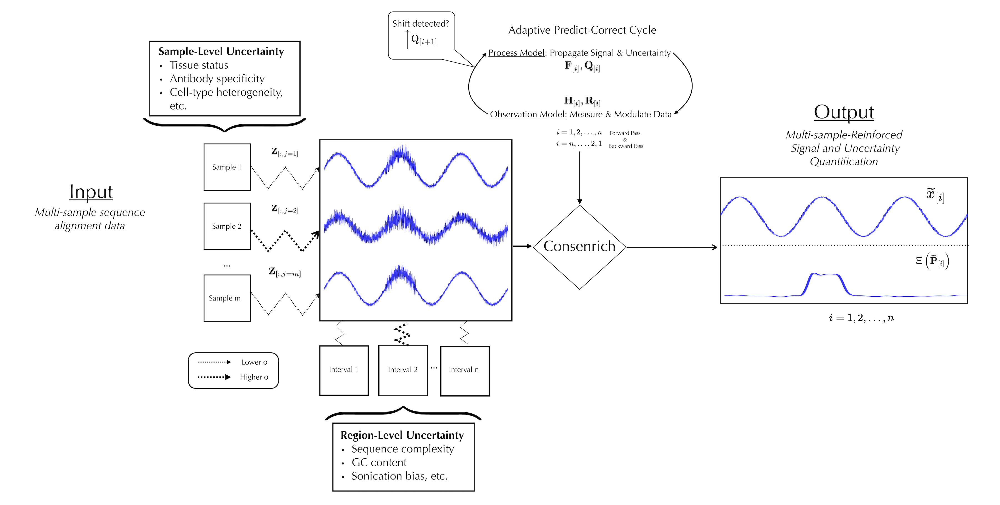

.. consenrich documentation master file, created by
   sphinx-quickstart on Mon Jul 28 02:35:14 2025.
   You can adapt this file completely to your liking, but it should at least
   contain the root `toctree` directive.

=========================
Consenrich
=========================

.. toctree::
   :maxdepth: 2
   :caption: Contents

Consenrich is an adaptive linear filter for genome-wide estimation of signals hidden in
noisy multi-sample HTS datasets.

Installation
--------------------------
.. toctree::
   :maxdepth: 2
   :caption: Installation

Use `pip` + `PyPI`
~~~~~~~~~~~~~~~~~~~~~~~~~~~~~~

Consenrich is available on PyPI and can be installed with pip.

   .. code-block:: bash

      python -m pip install consenrich

This is the more convenient but potentially less flexible option.

Build from source and install the package
~~~~~~~~~~~~~~~~~~~~~~~~~~~~~~~~~~~~~~~~~~~

To build from source, you will need `setuptools` and `wheel` installed:

   .. code-block:: bash

      python -m pip install setuptools wheel

If you prefer to use a virtual environment, see the YAML file :download:`consenrichEnv <../consenrichEnv.yaml>`.
This can be used to create an isolated setup with all required dependencies using
`conda <https://docs.conda.io/en/latest/>`_ or `mamba <https://mamba.readthedocs.io/en/latest/>`_.

Clone the repository:

   .. code-block:: bash

      git clone https://github.com/nolan-h-hamilton/Consenrich.git

Build and install the package:

   .. code-block:: bash

      cd Consenrich
      python -m build
      python -m pip install .

Usage
--------------------------

.. toctree::
   :maxdepth: 2
   :caption: Usage

A brief but nontrivial analysis is carried out below for demonstration.

Publicly available data from ENCODE (H3K27ac ChIP-seq data) is used in this analysis.

Input Data
~~~~~~~~~~~~~~

The input dataset consists of four donors' treatment and control epidermal samples.

.. list-table:: Input Data
   :header-rows: 1
   :widths: 50 50 50 50

   * - Experiment
     - Biosample
     - H3K27ac Alignment
     - Control Alignment

   * - `ENCSR214UZE <https://www.encodeproject.org/experiments/ENCSR214UZE/>`_
     - Epidermis/Female/71
     - `ENCFF793ZHL.bam <https://www.encodeproject.org/files/ENCFF793ZHL/@@download/ENCFF793ZHL.bam>`_
     - `ENCFF444WVG.bam <https://www.encodeproject.org/files/ENCFF444WVG/@@download/ENCFF444WVG.bam>`_
   * - `ENCSR334DRN <https://www.encodeproject.org/experiments/ENCSR334DRN/>`_
     - Epidermis/Male/67
     - `ENCFF647VPO.bam <https://www.encodeproject.org/files/ENCFF647VPO/@@download/ENCFF647VPO.bam>`_
     - `ENCFF619NYP.bam <https://www.encodeproject.org/files/ENCFF619NYP/@@download/ENCFF619NYP.bam>`_
   * - `ENCSR340ZTB <https://www.encodeproject.org/experiments/ENCSR340ZTB/>`_
     - Epidermis/Female/80
     - `ENCFF809VKT.bam <https://www.encodeproject.org/files/ENCFF809VKT/@@download/ENCFF809VKT.bam>`_
     - `ENCFF898LKJ.bam <https://www.encodeproject.org/files/ENCFF898LKJ/@@download/ENCFF898LKJ.bam>`_
   * - `ENCSR386CKJ <https://www.encodeproject.org/experiments/ENCSR386CKJ/>`_
     - Epidermis/Male/75
     - `ENCFF295EFL.bam <https://www.encodeproject.org/files/ENCFF295EFL/@@download/ENCFF295EFL.bam>`_
     - `ENCFF490MWV.bam <https://www.encodeproject.org/files/ENCFF490MWV/@@download/ENCFF490MWV.bam>`_

**Downloading alignment files**

Run the following shell script to obtain the input BAM files for this demo.
You can also use `curl -O <URL>` in place of `wget <URL>`.

.. code:: bash

   encodeFiles=https://www.encodeproject.org/files

   for file in ENCFF793ZHL ENCFF647VPO ENCFF809VKT ENCFF295EFL; do
       wget "$encodeFiles/$file/@@download/$file.bam"
   done

   for ctrl in ENCFF444WVG ENCFF619NYP ENCFF898LKJ ENCFF490MWV; do
       wget "$encodeFiles/$ctrl/@@download/$ctrl.bam"
   done

   samtools index -M *.bam

Using a YAML Configuration file
~~~~~~~~~~~~~~~~~~~~~~~~~~~~~~~~

Now, with the needed alignment files downloaded and indexed, we can copy and paste the following YAML into a file named `demoHistoneChIPSeq.yaml`.
Feel free to tinker with parameters (:code:`<process,observation,etc.>Params`), but we will use defaults in the demo.

Note that Consenrich can be run programmatically using the API instead of a command-line interface (CLI) used below.

For a quick trial (:math:`\approx` 1 minute), you can restrict analysis to chromosome 22 and still reproduce the results shown in the IGV browser snapshot below by specifying :code:`genomeParams.chromosomes: ['chr22']`.

.. code-block:: yaml
   :name: demoHistoneChIPSeq.yaml

   experimentName: demoHistoneChIPSeq
   genomeParams.name: hg38
   genomeParams.excludeForNorm: ['chrX', 'chrY']
   inputParams.bamFiles: [ENCFF793ZHL.bam,
   ENCFF647VPO.bam,
   ENCFF809VKT.bam,
   ENCFF295EFL.bam]
   inputParams.bamFilesControl: [ENCFF444WVG.bam,
   ENCFF619NYP.bam,
   ENCFF898LKJ.bam,
   ENCFF490MWV.bam]

**Control inputs**. For assays like ATAC-seq, DNase-seq, or CUT&RUN, control samples are optional: simply omit :code:`inputParams.bamFilesControl`.

Run Consenrich
~~~~~~~~~~~~~~~~

With the config file saved, we can invoke the command-line interface to run Consenrich:

.. code-block::
   :name: Run Consenrich

   consenrich --config demoHistoneChIPSeq.yaml

Output bedGraph/bigWig files will be saved to the current working directory, prefixed by :code:`consenrichOutput_<experimentName>`.

**IGV snapshot: demoHistoneChIPSeq**

.. image:: ../images/ConsenrichIGVdemoHistoneChIPSeq.png
   :alt: Output Consenrich Signal Estimates
   :width: 85%
   :align: center

* The Consenrich-estimated signal track is displayed in the top row (blue) over a generic 25kb region of chromosome 22.
* For reference, we also show ENCODE's `fold change over control` bigwig tracks for each sample (red) and the input treatment/control alignments (black).

Refer to the :code:`<process,observation,etc.>Params` classes in module `consenrich.core` for complete documentation of available parameters and arguments.
Consenrich supports a variety of functional genomics assays including ATAC-seq, DNase-seq, CUT&RUN. 

=========================
API Reference
=========================

.. toctree::
   :maxdepth: 2
   :caption: Modules

Core API: `consenrich.core`
----------------------------

.. toctree::
   :maxdepth: 1
   :caption: core

.. note::
   This section contains key components of Consenrich subject to versioning.

.. autoclass:: consenrich.core.processParams

.. autoclass:: consenrich.core.observationParams

.. autoclass:: consenrich.core.stateParams

.. autoclass:: consenrich.core.detrendParams

.. autoclass:: consenrich.core.inputParams

.. autoclass:: consenrich.core.genomeParams

.. autoclass:: consenrich.core.countingParams

.. autoclass:: consenrich.core.samParams

.. autofunction:: consenrich.core.getChromRanges

.. autofunction:: consenrich.core.getChromRangesJoint

.. autofunction:: consenrich.core.getReadLength

.. autofunction:: consenrich.core.readBamSegments

.. autofunction:: consenrich.core.getAverageLocalVarianceTrack

.. autofunction:: consenrich.core.constructMatrixF

.. autofunction:: consenrich.core.constructMatrixQ

.. autofunction:: consenrich.core.constructMatrixH

.. autofunction:: consenrich.core.runConsenrich

.. autofunction:: consenrich.core.getPrimaryState

.. autofunction:: consenrich.core.getStateCovarTrace

.. autofunction:: consenrich.core.getPrecisionWeightedResidual

.. autofunction:: consenrich.core.getMuncTrack

.. autofunction:: consenrich.core.sparseIntersection

.. autofunction:: consenrich.core.adjustFeatureBounds

.. autofunction:: consenrich.core.getSparseMap

Background/Trend Removal and Scaling: `consenrich.detrorm`
-----------------------------------------------------------

.. toctree::
   :maxdepth: 1
   :caption: detrorm

.. note::
    See :class:`consenrich.core.detrendParams` for relevant parameters.

.. autofunction:: consenrich.detrorm.getScaleFactor1x

.. autofunction:: consenrich.detrorm.getScaleFactorPerMillion

.. autofunction:: consenrich.detrorm.getPairScaleFactors

.. autofunction:: consenrich.detrorm.detrendTrack

Genomic resources and constants: `consenrich.constants`
-----------------------------------------------------------
.. toctree::
   :maxdepth: 1
   :caption: constants

.. note::
      This module is provided for *convenience*. If a genome is not listed here, users can still specify resources manually.
      For any genome assembly, you can provide the following manually.

.. autofunction:: consenrich.constants.getEffectiveGenomeSize

.. autofunction:: consenrich.constants.getGenomeResourceFile

.. autofunction:: consenrich.constants.resolveGenomeName

Cython functions: `consenrich.cconsenrich`
-------------------------------------------
.. toctree::
   :maxdepth: 1
   :caption: cconsenrich

Several functions are implemented in Cython for efficiency in the main loop and during matrix construction.

.. autofunction:: consenrich.cconsenrich.creadBamSegment

.. autofunction:: consenrich.cconsenrich.cinvertMatrixE

.. autofunction:: consenrich.cconsenrich.updateProcessNoiseCovariance