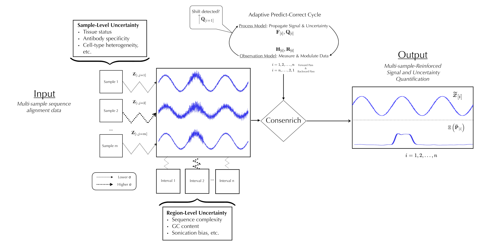

Consenrich Homepage
===========================

.. toctree::
   :maxdepth: 1
   :caption: Contents
   :name: Consenrich Homepage
   :hidden:

   installation
   examples
   modules

Consenrich is a regularized state-space estimator for quantitative genome-wide signal tracks from multi-sample epigenomic HTS data.

It is designed for fast, interpretable consensus signal estimation with moderated uncertainty for tasks such as:

* Consensus detection of open chromatin regions, TF binding, histone modification, etc.
* Candidate prioritization for differential analyses, functional validation, integrative modeling, etc.

.. list-table::
   :widths: 40 50
   :header-rows: 1

   * - Resource
     - Link
   * - Manuscript Preprint
     - `bioRxiv <https://www.biorxiv.org/content/10.1101/2025.02.05.636702v2>`_
   * - Source Code
     - `GitHub <https://github.com/nolan-h-hamilton/Consenrich>`_
   * - Documentation, Examples, etc.
     - `(This site) <https://nolan-h-hamilton.github.io/Consenrich/>`_
   * - Contact
     - Nolan [dot] Hamilton <at> unc [dot] edu
