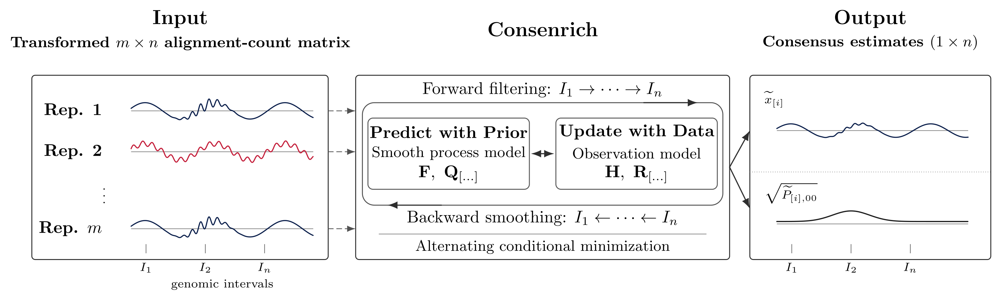

Consenrich
===========================

.. toctree::
   :maxdepth: 1
   :caption: Contents
   :name: Consenrich Homepage
   :hidden:

   installation
   examples
   params

Consenrich estimates shared latent regulatory signals from noisy, multi-sample epigenomic sequencing measurements.

**Input:** Sequencing data in BAM, 10x fragments, or other supported formats from bulk or single-cell ATAC-seq, DNase-seq, ChIP-seq, CUT&RUN, CUT&Tag, or related assays.

**Output:** Consensus signal estimate tracks (bedGraph, bigWig), associated uncertainty tracks (bedGraph, bigWig), and optional consensus peak calls (narrowPeak, gappedPeak, BED).

.. list-table::
   :widths: 40 50
   :header-rows: 1

   * - Resource
     - Link
   * - Manuscript Preprint
     - `bioRxiv <https://www.biorxiv.org/content/10.1101/2025.02.05.636702v3>`_
   * - Source Code
     - `GitHub <https://github.com/nolan-h-hamilton/Consenrich>`_
   * - Documentation, Examples, etc.
     - `(This site) <https://nolan-h-hamilton.github.io/Consenrich/>`_
   * - Contact
     - Nolan [dot] Hamilton <at> unc [dot] edu
