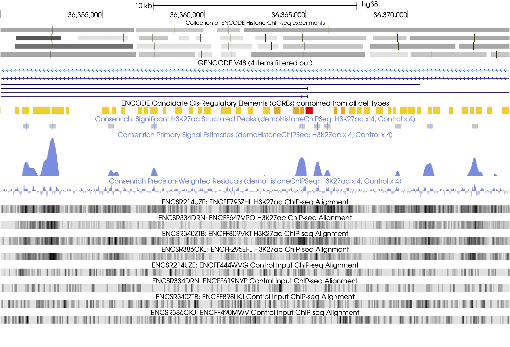

.. consenrich documentation master file, created by
   sphinx-quickstart on Mon Jul 28 02:35:14 2025.
   You can adapt this file completely to your liking, but it should at least
   contain the root `toctree` directive.

=========================
Consenrich
=========================

.. toctree::
   :maxdepth: 1
   :caption: Contents

`Consenrich <https://github.com/nolan-h-hamilton/Consenrich>`_ estimates genome-wide regulatory signals 'hidden' in *noisy, multi-sample HTS datasets*.

.. image:: ../images/noise.png
   :alt: Simplified schematic of Consenrich
   :width: 85%
   :align: center

Consenrich explicitly models critical but often-overlooked aspects in genomic signal quantification:

#. *Sample-specific* and *region-specific* noise across the genome, addressing both technical and biological sources that corrupt sequencing data.
#.  Signal and variance propagation to account for spatial dependencies in genome-wide sequencing data.

These refinements grant immediate practical appeal to a wide array of downstream tasks requiring quantitative, uncertainty-calibrated analysis of shared regulatory signals.

A manuscript preprint is available on `bioRxiv <https://www.biorxiv.org/content/10.1101/2025.02.05.636702v2>`_.

Usage
--------------------------

.. toctree::
   :maxdepth: 2
   :caption: Usage

A brief but nontrivial analysis using H3K27ac ChIP-seq data is carried out below for demonstration.

Input Data
~~~~~~~~~~~~~~

The input dataset consists of four donors' treatment and control epidermal samples from ENCODE.

.. list-table:: Input Data
   :header-rows: 1
   :widths: 50 50 50 50

   * - Experiment
     - Biosample
     - H3K27ac Alignment
     - Control Alignment

   * - `ENCSR214UZE <https://www.encodeproject.org/experiments/ENCSR214UZE/>`_
     - Epidermis/Female/71
     - `ENCFF793ZHL.bam <https://www.encodeproject.org/files/ENCFF793ZHL/@@download/ENCFF793ZHL.bam>`_
     - `ENCFF444WVG.bam <https://www.encodeproject.org/files/ENCFF444WVG/@@download/ENCFF444WVG.bam>`_
   * - `ENCSR334DRN <https://www.encodeproject.org/experiments/ENCSR334DRN/>`_
     - Epidermis/Male/67
     - `ENCFF647VPO.bam <https://www.encodeproject.org/files/ENCFF647VPO/@@download/ENCFF647VPO.bam>`_
     - `ENCFF619NYP.bam <https://www.encodeproject.org/files/ENCFF619NYP/@@download/ENCFF619NYP.bam>`_
   * - `ENCSR340ZTB <https://www.encodeproject.org/experiments/ENCSR340ZTB/>`_
     - Epidermis/Female/80
     - `ENCFF809VKT.bam <https://www.encodeproject.org/files/ENCFF809VKT/@@download/ENCFF809VKT.bam>`_
     - `ENCFF898LKJ.bam <https://www.encodeproject.org/files/ENCFF898LKJ/@@download/ENCFF898LKJ.bam>`_
   * - `ENCSR386CKJ <https://www.encodeproject.org/experiments/ENCSR386CKJ/>`_
     - Epidermis/Male/75
     - `ENCFF295EFL.bam <https://www.encodeproject.org/files/ENCFF295EFL/@@download/ENCFF295EFL.bam>`_
     - `ENCFF490MWV.bam <https://www.encodeproject.org/files/ENCFF490MWV/@@download/ENCFF490MWV.bam>`_

**Downloading alignment files**

Run the following shell script to obtain the input BAM files for this demo.
You can also use `curl -O <URL>` in place of `wget <URL>`.

.. code:: bash

   encodeFiles=https://www.encodeproject.org/files

   for file in ENCFF793ZHL ENCFF647VPO ENCFF809VKT ENCFF295EFL; do
       wget "$encodeFiles/$file/@@download/$file.bam"
   done

   for ctrl in ENCFF444WVG ENCFF619NYP ENCFF898LKJ ENCFF490MWV; do
       wget "$encodeFiles/$ctrl/@@download/$ctrl.bam"
   done

   samtools index -M *.bam

Using a YAML Configuration file
~~~~~~~~~~~~~~~~~~~~~~~~~~~~~~~~

Now, with the needed alignment files downloaded and indexed, we can copy and paste the following YAML into a file named `demoHistoneChIPSeq.yaml`.
Feel free to tinker with parameters (:code:`<process,observation,etc.>Params`), but we will use defaults in the demo.

Note that Consenrich can be run programmatically using the API instead of a command-line interface (CLI) used below.

For a quick trial (:math:`\approx` 1 minute), you can restrict analysis to chromosome 22 and still reproduce the results shown in the IGV browser snapshot below by specifying :code:`genomeParams.chromosomes: ['chr22']`.

.. code-block:: yaml
   :name: demoHistoneChIPSeq.yaml

   experimentName: demoHistoneChIPSeq
   genomeParams.name: hg38
   genomeParams.excludeForNorm: ['chrX', 'chrY']
   inputParams.bamFiles: [ENCFF793ZHL.bam,
   ENCFF647VPO.bam,
   ENCFF809VKT.bam,
   ENCFF295EFL.bam]
   inputParams.bamFilesControl: [ENCFF444WVG.bam,
   ENCFF619NYP.bam,
   ENCFF898LKJ.bam,
   ENCFF490MWV.bam]

**Control inputs**. For assays like ATAC-seq, DNase-seq, or CUT&RUN, control samples are optional: simply omit :code:`inputParams.bamFilesControl`.

Run Consenrich
~~~~~~~~~~~~~~~~

With the config file saved, we can invoke the command-line interface to run Consenrich:

.. code-block::
   :name: Run Consenrich

   consenrich --config demoHistoneChIPSeq.yaml

Output bedGraph/bigWig files will be saved to the current working directory, prefixed by :code:`consenrichOutput_<experimentName>`.

**IGV snapshot: demoHistoneChIPSeq**

* The Consenrich-estimated signal track is displayed in the top row (blue) over a generic 25kb region of chromosome 22.
* For reference, we also show ENCODE's `fold change over control` bigwig tracks for each sample (red) and the input treatment/control alignments (black).

.. note::

   Refer to the :code:`<process,observation,etc.>Params` classes in module `consenrich.core` for complete documentation configuration options.

Key components of Consenrich are implemented in this repository to  permit flexible customization and extension: *the command-line
interface is primarily intended as a convenience wrapper around the core API*.

Some users may find it beneficial to run Consenrich programmatically (e.g., Jupyter notebooks, Python scripts), e.g., to apply specific preprocessing steps or other customizations.
The API is designed to be flexible and can be easily integrated into existing workflows. See API documentation for more details.

Installation
--------------------------
.. toctree::
   :maxdepth: 2
   :caption: Installation

From PyPI
~~~~~~~~~~~~~~~~~~~~~~~~~~~~~~

Multiple binary `wheels <https://peps.python.org/pep-0427/>`_ are distributed via `PyPI <https://pypi.org/project/consenrich/#files>`_ to accomodate different operating systems, python versions, and architectures.
To install the latest version, run:

   .. code-block:: bash

      python -m pip install consenrich --upgrade

If a wheel for your platform is not available, see below to build from source. Please feel free to open an issue on the `GitHub repository <https://github.com/nolan-h-hamilton/Consenrich/issues>`_ if you encounter any problems.

Build from source
~~~~~~~~~~~~~~~~~~~~~~~~~~~~~~~~~~~~~~~~~~~

To build from source, first ensure you have the necessary package development tools

   .. code-block:: bash

      python -m pip install setuptools wheel Cython build

If you prefer to use a virtual environment, see the YAML file :download:`consenrichEnv <../consenrichEnv.yaml>`.
This can be used to create an isolated setup with all required dependencies using
`conda <https://docs.conda.io/en/latest/>`_ or `mamba <https://mamba.readthedocs.io/en/latest/>`_.

Clone the repository:

   .. code-block:: bash

      git clone https://github.com/nolan-h-hamilton/Consenrich.git

Build and install the package:

   .. code-block:: bash

      cd Consenrich
      python -m build
      python -m pip install .

Previous versions
~~~~~~~~~~~~~~~~~~~~~~~~~~~~~~

To install a specific version of Consenrich from PyPI, you can specify the version number in the pip install command, for example:

   .. code-block:: bash

      python -m pip install consenrich==0.1.13b1

=========================
API Reference
=========================

.. toctree::
   :maxdepth: 1
   :caption: Modules

Core API: `consenrich.core`
----------------------------

.. toctree::
   :maxdepth: 1
   :caption: core

The core module implements the main aspects of Consenrich.

.. autoclass:: consenrich.core.processParams

.. autoclass:: consenrich.core.observationParams

.. autoclass:: consenrich.core.stateParams

.. autoclass:: consenrich.core.detrendParams

.. autoclass:: consenrich.core.inputParams

.. autoclass:: consenrich.core.genomeParams

.. autoclass:: consenrich.core.countingParams

.. autoclass:: consenrich.core.samParams

.. autoclass:: consenrich.core.matchingParams

.. autofunction:: consenrich.core.getChromRanges

.. autofunction:: consenrich.core.getChromRangesJoint

.. autofunction:: consenrich.core.getReadLength

.. autofunction:: consenrich.core.readBamSegments

.. autofunction:: consenrich.core.getAverageLocalVarianceTrack

.. autofunction:: consenrich.core.constructMatrixF

.. autofunction:: consenrich.core.constructMatrixQ

.. autofunction:: consenrich.core.constructMatrixH

.. autofunction:: consenrich.core.runConsenrich

.. autofunction:: consenrich.core.getPrimaryState

.. autofunction:: consenrich.core.getStateCovarTrace

.. autofunction:: consenrich.core.getPrecisionWeightedResidual

.. autofunction:: consenrich.core.getMuncTrack

.. autofunction:: consenrich.core.sparseIntersection

.. autofunction:: consenrich.core.adjustFeatureBounds

.. autofunction:: consenrich.core.getSparseMap

Background/Trend Removal and Scaling: `consenrich.detrorm`
-----------------------------------------------------------

.. toctree::
   :maxdepth: 1
   :caption: detrorm

.. note::
    See :class:`consenrich.core.detrendParams` for relevant parameters.

.. autofunction:: consenrich.detrorm.getScaleFactor1x

.. autofunction:: consenrich.detrorm.getScaleFactorPerMillion

.. autofunction:: consenrich.detrorm.getPairScaleFactors

.. autofunction:: consenrich.detrorm.detrendTrack

Genomic resources and constants: `consenrich.constants`
-----------------------------------------------------------
.. toctree::
   :maxdepth: 1
   :caption: constants

.. note::
      This module is provided for *convenience*. If a genome is not listed here, users can still specify resources manually.
      For any genome assembly, you can provide the following manually.

.. autofunction:: consenrich.constants.getEffectiveGenomeSize

.. autofunction:: consenrich.constants.getGenomeResourceFile

.. autofunction:: consenrich.constants.resolveGenomeName

Detecting *structured enrichment* with `consenrich.matching`
-----------------------------------------------------------------------
.. toctree::
   :maxdepth: 1
   :caption: matching

(*Experimental*). Detect genomic regions showing both **enrichment** and **non-random structure** in multiple samples.

We detect 'structured enrichment' in the cross-correlation between the Consenrich signal and a downsampled discrete wavelet template (unit-norm'd)
Local maxima of the 'response' are tested for significance (non-parametric) using an empirical, approximated null distribution to control false positives.

Verifying enrichment *and* structure offers two interesting benefits:

#. Targeted detection of biologically relevant features which may exhibit distinct spatial patterns in a given assay, e.g., `Cremona et al., 2015 <https://bmcbioinformatics.biomedcentral.com/articles/10.1186/s12859-015-0787-6>`_
#. Improved confidence that the matched, peak-like regions are *not* due to stochastic noise which is characteristically *unstructured*.

- Denote the sequence of Consenrich signal estimates,

.. math::

   \widetilde{\mathbf{x}} = \{\widetilde{x}_{[i]}\}_{i=1}^{i=n}

- Define a *template* for matching as,

.. math::

   \boldsymbol{\xi} = \{\xi_{[t]}\}_{t=1}^{t=T}

which we define using downsampled discrete wavelet functions (`Cascade algorithm <https://en.wikipedia.org/wiki/Cascade_algorithm>`_). These provide a flexible, multi-resolution representation allowing for effective matching at different scales. Note that the template is unit-normalized in the default implementation.

- Define the *response sequence* as the convolution of the signal estimates with the (reversed) template:

.. math::

   \{\mathcal{R}_{[i]}\}_{i=1}^{i=n} = \widetilde{\mathbf{x}} \ast \boldsymbol{\xi}^{\textsf{rev}}

At genomic interval :math:`i \in \{1, \ldots, n\}`, a 'match' is declared if the following hold:

- :math:`\mathcal{R}_{[i]}` is a relative maximum within a window defined by the template length :math:`T`.
- :math:`\mathcal{R}_{[i]}` exceeds a significance cutoff determined by the :math:`1 - \alpha` quantile of an approximated null distribution (See :func:`cconsenrich.csampleBlockStats`).
- *Optional*: The *signal* value at the response-maximum is above `minSignalAtMaxima`.

Pattern matching can be introduced in the Usage Demo by adding the following to the YAML config file:

.. code-block:: yaml
    :name: demoMatchingParameters

    matchingParams.templateNames: [db2]
    matchingParams.cascadeLevels: [2]
    matchingParams.iters: 25_000
    matchingParams.alpha: 0.01

In the IGV browser image below, matches are displayed as blue BED features (peak-like) above the Consenrich signal track. Note, this is the same dataset as in *Usage*.

.. image:: ../images/matchingDemo.png
   :alt: Localization in multi-sample H3K27ac ChIP-seq data
   :width: 85%
   :align: center

.. note::

   Rather than applying the *structured enrichment* matching technique, more traditional (consensus) peak calling on Consenrich signal track output can be performed using any peak caller that accepts bedGraph and/or bigWig input, e.g., `ROCCO <https://github.com/nolan-h-hamilton/ROCCO>`_,

   ``rocco -i <ConsenrichOutput.bw> -g <genomeName> [...]``

   Other peak callers accepting bedGraph or bigWig input may be plausible downstream companions to Consenrich, too (e.g., `MACS bdgpeakcall <https://macs3-project.github.io/MACS/docs/bdgpeakcall.html>`_)

   - To penalize uncertainty during peak calling, users may consider incorporating Consenrich signals' uncertainty metrics into the peak calling process.

     - For instance, consider scaling the state estimates, :func:`consenrich.core.getPrimaryState`, with inverse weights from absolute values of :func:`consenrich.core.getPrecisionWeightedResidual` and/or :func:`consenrich.core.getStateCovarTrace`. If not using the API, the output bigWig files (state, residuals) can be operated on using `deeptools bigWigCompare <https://deeptools.readthedocs.io/en/latest/content/tools/bigwigCompare.html>`_

.. autofunction:: consenrich.matching.matchWavelet

Cython functions: `consenrich.cconsenrich`
-------------------------------------------
.. toctree::
   :maxdepth: 1
   :caption: cconsenrich

Several components are implemented with strong typing/manual memory management in Cython for efficiency.

.. autofunction:: consenrich.cconsenrich.creadBamSegment

.. autofunction:: consenrich.cconsenrich.cinvertMatrixE

.. autofunction:: consenrich.cconsenrich.updateProcessNoiseCovariance

.. autofunction:: consenrich.cconsenrich.csampleBlockStats

.. autofunction:: consenrich.cconsenrich.cSparseAvg