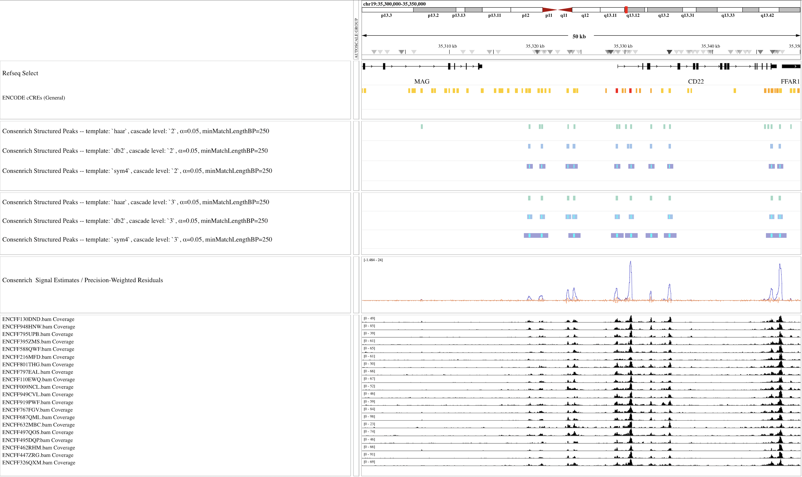

API Reference
---------------

.. toctree::
   :maxdepth: 1
   :caption: API
   :name: API

``consenrich.core``
~~~~~~~~~~~~~~~~~~~~~~

.. toctree::
    :maxdepth: 2
    :caption: ``core``
    :name: core

The core module implements the main aspects of Consenrich and defines key parameter classes.

.. autoclass:: consenrich.core.processParams
.. autoclass:: consenrich.core.observationParams
.. autoclass:: consenrich.core.stateParams
.. autoclass:: consenrich.core.detrendParams
.. autoclass:: consenrich.core.inputParams
.. autoclass:: consenrich.core.genomeParams
.. autoclass:: consenrich.core.countingParams
.. autoclass:: consenrich.core.samParams
.. autoclass:: consenrich.core.matchingParams
.. autofunction:: consenrich.core.getChromRanges
.. autofunction:: consenrich.core.getChromRangesJoint
.. autofunction:: consenrich.core.getReadLength
.. autofunction:: consenrich.core.readBamSegments
.. autofunction:: consenrich.core.getAverageLocalVarianceTrack
.. autofunction:: consenrich.core.constructMatrixF
.. autofunction:: consenrich.core.constructMatrixQ
.. autofunction:: consenrich.core.constructMatrixH
.. autofunction:: consenrich.core.runConsenrich
.. autofunction:: consenrich.core.getPrimaryState
.. autofunction:: consenrich.core.getStateCovarTrace
.. autofunction:: consenrich.core.getPrecisionWeightedResidual
.. autofunction:: consenrich.core.getMuncTrack
.. autofunction:: consenrich.core.sparseIntersection
.. autofunction:: consenrich.core.adjustFeatureBounds
.. autofunction:: consenrich.core.getSparseMap
.. autofunction:: consenrich.core.getBedMask

``consenrich.detrorm``
~~~~~~~~~~~~~~~~~~~~~~

.. toctree::
    :maxdepth: 2
    :caption: ``detrorm``
    :name: detrorm

.. autofunction:: consenrich.detrorm.getScaleFactor1x
.. autofunction:: consenrich.detrorm.getScaleFactorPerMillion
.. autofunction:: consenrich.detrorm.getPairScaleFactors
.. autofunction:: consenrich.detrorm.detrendTrack

``consenrich.constants``
~~~~~~~~~~~~~~~~~~~~~~~~~~~

.. toctree::
    :maxdepth: 2
    :caption: ``constants``
    :name: constants

.. important::

    This module is provided for *convenience*. If a genome is not listed here, users can still specify resources (e.g., sizes file, blacklist) manually.

.. autofunction:: consenrich.constants.getEffectiveGenomeSize
.. autofunction:: consenrich.constants.getGenomeResourceFile
.. autofunction:: consenrich.constants.resolveGenomeName

.. _match:

``consenrich.matching``
~~~~~~~~~~~~~~~~~~~~~~~~~~~~~~~~~~~~~~~~~~

.. toctree::
    :maxdepth: 2
    :caption: ``matching``
    :name: matching

(*Experimental*). Detect genomic regions showing both **enrichment** and **non-random structure**.

- Take a set of successive genomic intervals :math:`i=1,2,\ldots,n`, each spanning :math:`L` base pairs.

- Define a 'consensus' signal track over the genomic intervals, estimated from multiple independent samples' high-throughput functional genomics sequencing data:

.. math::

  \widetilde{\mathbf{x}} = \{\widetilde{x}_{[i]}\}_{i=1}^{i=n}.

Note, we use the sequence of Consenrich signal estimates to define :math:`\widetilde{\mathbf{x}}`.

**Aim**: Determine a set of peak-like genomic regions where the consensus signal track :math:`\widetilde{\mathbf{x}}` exhibits both:

#. *Enrichment* (large relative amplitude)
#. *Non-random structure* (polynomial or oscillatory trends)

**Why**: Prioritizing genomic regions that are both enriched and show a prescribed level of structure is appealing for several reasons. Namely,

* Improved confidence that the identified genomic regions are not due to stochastic noise, which is characteristically unstructured.
* Targeted detection of biologically relevant signal patterns in a given assay (`Cremona et al., 2015 <https://bmcbioinformatics.biomedcentral.com/articles/10.1186/s12859-015-0787-6>`_, `Parodi et al., 2017 <https://doi.org/10.1093/bioinformatics/btx201>`_)
* Speed: runs in seconds on a genome-wide scale.

In the case of Consenrich, that :math:`\widetilde{\mathbf{x}}` is reinforced by multiple samples and accounts for multiple sources of uncertainty is particularly advantageous--it provides a more reliable basis for evaluating legitimate structure and identifying high-resolution features. We need not rely exclusively on least-squares fits to noisy data in small sample sizes.

Further, we can utilize an encompassing discrete wavelet-based representation of structure that computes *genome-wide results on the scale of seconds* and can be easily tuned to target generic, peak-like patterns or more complex structures.

Algorithm Overview
""""""""""""""""""""""

To detect regions of 'structured enrichment', we run an approach akin to `matched filtering <https://en.wikipedia.org/wiki/Matched_filter>`_, with
*templates* derived from discrete samplings of wavelet functions:

.. math::

  \boldsymbol{\xi} = \{\xi_{[t]}\}_{t=1}^{t=T}.

We define the *response sequence* as the cross-correlation

.. math::

  \{\mathcal{R}_{[i]}\}_{i=1}^{i=n} = \widetilde{\mathbf{x}} \star \boldsymbol{\xi}

Intuitively, where :math:`\mathcal{R}_{[i]}` is large, there is greater evidence that the signal :math:`\widetilde{\mathbf{x}}` is enriched and exhibits structure similar to the template :math:`\boldsymbol{\xi}`.

At genomic interval :math:`i \in \{1, \ldots, n\}`, a *match* is declared if the following are true:

- :math:`\mathcal{R}_{[i]}` is a relative maximum within a window defined by the template length :math:`T`.
- :math:`\mathcal{R}_{[i]}` exceeds a significance cutoff determined by the :math:`1 - \alpha` quantile of an approximated null distribution (See :func:`cconsenrich.csampleBlockStats`).
- *Optional*: The *signal* value at the response-maximum is above ``minSignalAtMaxima``.

.. seealso::

  Sections :ref:`minimal` and/or :ref:`additional-examples` which include browser shots demonstrating qualitative behavior of this feature.

In the following browser snapshot, we sweep several key matching parameters.

As opposed to the configs in :ref:`additional-examples`, here, we set ``matchingParams.merge: false`` to clearly illustrate contrasting results. Note that the matching routine requires only seconds of runtime, and it is straightforward to run multiple configurations and compare results.

- ``matchingParams.templateNames``
  - Narrow, condensed features :math:`\rightarrow` short wavelet-based templates (e.g., ``haar``, ``db2``).
  - Broader features :math:`\rightarrow` longer, symmetric wavelet-based templates (e.g., ``sym4``).
  - Oscillatory features :math:`\rightarrow` longer, higher-order wavelets (e.g., ``db8``, ``dmey``).

- ``matchingParams.alpha`` (Significance Threshold)
  - Signifcance is measured relative to an approximated null distribution of response values.
  - Tunes precision vs. recall -- the stringency of match detection.
  - Smaller values :math:`\rightarrow` fewer but higher-confidence matches; larger values :math:`\rightarrow` more but lower-confidence matches.

- ``matchingParams.minMatchLengthBP`` (Feature Width Threshold)
  - Enforces a minimum feature width (base pairs)
  - Increase to prevent matches with features that are more narrow than the underlying pattern of interest.

- ``matchingParams.minSignalAtMaxima`` (Signal Threshold)
  - Enforces a minimum Consenrich *signal estimate* over the detected maxima.
  - If ``None``, defaults to the median of nonzero signal values.

**Suggested Defaults**

These are not exhaustive but may provide a reasonable starting point for common use cases. See also :ref:`additional-examples` for practical demonstrations.

- Narrow peak calls:

.. code-block:: yaml

  matchingParams.templateNames: [haar, db2]
  matchingParams.cascadeLevels: [2]
  matchingParams.alpha: 0.05
  matchingParams.minMatchLengthBP: 250
  matchingParams.mergeGapBP: 50

- Broad peak calls:

.. code-block:: yaml

  matchingParams.templateNames: [sym4]
  matchingParams.cascadeLevels: [2]
  matchingParams.alpha: 0.01
  matchingParams.minMatchLengthBP: 500
  matchingParams.mergeGapBP: 125

.. autofunction:: consenrich.matching.matchWavelet

.. autofunction:: consenrich.matching.mergeMatches

Cython functions: ``consenrich.cconsenrich``
~~~~~~~~~~~~~~~~~~~~~~~~~~~~~~~~~~~~~~~~~~~~~~

.. toctree::
    :maxdepth: 2
    :caption: ``cconsenrich``
    :name: cconsenrich

Several computationally burdensome tasks are written in `Cython <https://cython.org/>`_ for improved efficiency.

.. autofunction:: consenrich.cconsenrich.creadBamSegment
.. autofunction:: consenrich.cconsenrich.cinvertMatrixE
.. autofunction:: consenrich.cconsenrich.updateProcessNoiseCovariance
.. autofunction:: consenrich.cconsenrich.csampleBlockStats
.. autofunction:: consenrich.cconsenrich.cSparseAvg
.. autofunction:: consenrich.cconsenrich.cgetFragmentLength
.. autofunction:: consenrich.cconsenrich.cbedMask

